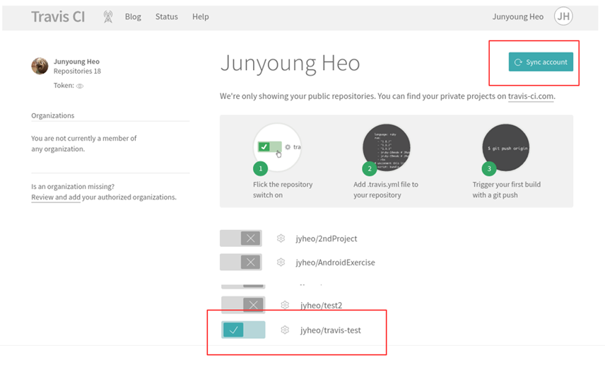
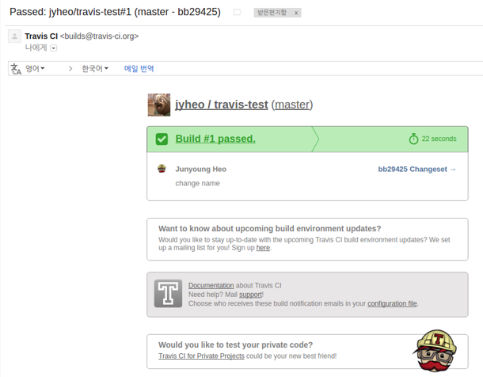
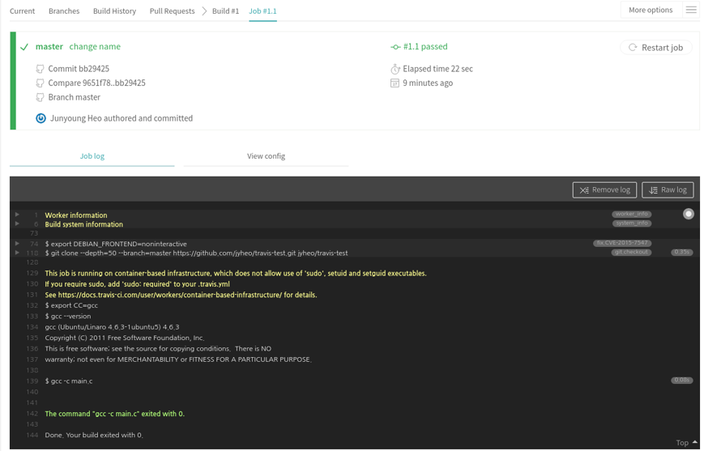

# CI/CD
<!-- _class: lead -->
### 허준영(jyheo@hansung.ac.kr)

## 지속적 통합(CI)
- Continuous Integration(지속적 통합)
- 지속적으로 퀄리티 컨트롤을 적용하는 프로세스를 실행
- 기존 문제점:
    - 원격 저장소에서 코드를 pull해서 작업을 오래하면
    - 언젠가는 저장소가 pull 했을 때와 너무 많이 달라지게 됨
    - 작업하는 시간보다 작업 내용을 통합하는데 걸리는 시간이 더 걸리게 되는 ‘통합의 지옥’이 발생
- 지속적 통합은 ‘통합 지옥’이 생기지 않도록 자주 통합
- 이를 위해 편리한 도구로
- Jenkins(설치형)와 Github Actions, Travis-CI(클라우드, github과 연동)가 있음

## Github Actions
- 

## Travis-CI
- https://travis-ci.org/
- Sign in with Github
    - Github 계정으로 로그인 가능
    - 처음 로그인 하면, travis에게 권한을 수락하도록 요청하니 허락해야 함.
        - Travis가 github의 repository를 확인할 수 있도록 해주는 것

## Travis-CI
- Github 저장소 활성화



##
- Travis 설정 파일인 .travis.yml 파일을 저장소에 생성
    - 파일 이름이 .으로 시작됨을 조심!
- Travis는 저장소에 push가 발생하면 .travis.yml에 따라 동작을 시작
- 언어별 설정에 대해서는
    - https://docs.travis-ci.com/user/language-specific/
- $ git push 하여 Travis가 작업을 시작하도록 한다.


## .travis.yml
- C언어용 아주 심플한 .travis.yml
    ```
    language: c
    script: gcc -c main.c
    ```
- 위에서 사용한 설정 외에 다양한 설정(deploy 등)이 가능함
    - 문서 참고: https://docs.travis-ci.com/


## 빌드 완료 후 이메일이 옴.
- Travis가 .travis.yml에 따라 자동으로 작업을 수행 후 결과를 이메일로 통보함


## 빌드 완료 후 Travis에서도 결과 확인 가능


## Exercise 1
- https://github.com/jyheo/travis-test 를 fork
- Travis에 들어가서 자신의 travis-test 저장소를 활성화
- $ git clone https://github.com/아이디/travis-test
- $ cd travis-test
- main.c 적절히 수정/commit
- $ git push origin master
- 기다린다. 이메일이 오면 Travis에 들어가서 결과를 확인한다.
