# Git Branch
<!-- _class: lead -->
### 허준영(jyheo@hansung.ac.kr)


## Git Branching
- 브랜칭 Branching?
    - 메인 라인에서 새로 브랜치(가지)를 내서 새 브랜치에서 작업을 수행하고 변경 이력을 남김.
    - 이 새 브랜치에서 수행한 작업은 메인 라인에 영향을 주지 않음.
- 브랜칭은 VCS의 꽃!
- Git의 장점 중의 하나가 가볍고 빠른 브랜칭
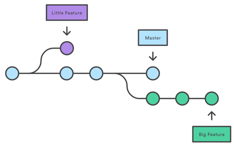


## Git Branching
- ‘master’ 브랜치
    - Git init에 의해 처음으로 저장소가 초기화될 때 기본으로 생기는 브랜치(일반적으로 메인 라인)
    - 그렇다고 다른 브랜치보다 특별한 것은 없음
- HEAD
    - 현재 사용중인 브랜치의 가장 최근 커밋을 가리키는 포인터
    ```
    > git branch
    * master
    testing
    > git log
    commit c55e7eb03723795df0a41203df2242c06a82fc5b (HEAD -> master)
    Author: Junyoung Heo <jyheo0@gmail.com>
    Date:   Fri Sep 13 22:49:45 2024 +0900
    ```


## 브랜치 생성
- git branch [브랜치 이름] [시작위치(생략가능)]
    - 시작위치를 생략하면 HEAD가 됨, 커밋ID나 Tag 이름 가능
    ```
    > git branch testing
    > git branch
    * master
      testing  
    ```
    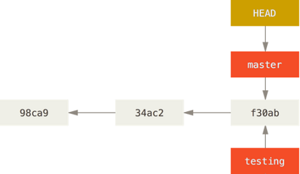
- Git 내부에서 브랜치는 커밋을 가리키는 포인터로 관리됨


## 작업 브랜치 변경
- 현재 작업 중인 브랜치를 다른 것으로 변경
    - git checkout [브랜치_이름]
    ```
    > git checkout testing
    Switched to branch 'testing'
    > git branch
      master
    * testing
    ```
    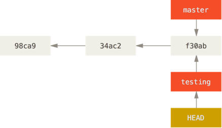


## 작업 브랜치 변경
- 변경된 브랜치(testing)에서 커밋을 하면.
    ```
    > echo "" > test.c
    > git add test.c
    > git commit -m "Add test.c"
    [testing `6888fc3`] Add test.c
     1 file changed, 0 insertions(+), 0 deletions(-)
     create mode 100644 test.c
    ```
    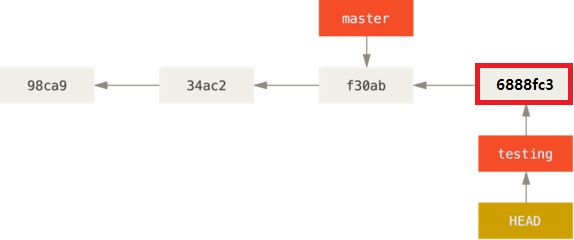


## 작업 브랜치 변경
- 다시 master 브랜치로 변경
    ```
    > git checkout master
    Switched to branch 'master'
    Your branch is up-to-date with 'origin/master'.
    ```
    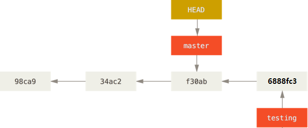
    - HEAD는 master의 마지막 커밋을 가리키게 바뀜.
    - 직전에 testing 브랜치에서 추가했던 test.c 파일은 보이지 않음
    

## 작업 브랜치 변경
- Master 브랜치에서 커밋을 하면.
    ```
    > notepad newfile.c
    > git commit -a -m "Add a new comment"
    [master `f1f2a4c`] Add a new comment
     1 file changed, 1 insertion(+)
    ```
    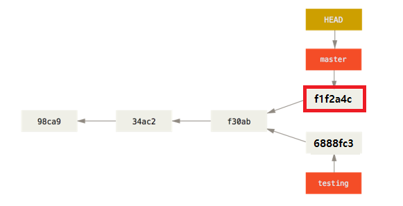


## 브랜치 합치기 Merge
- git merge [현재 브랜치에 합칠 브랜치]
    - master 브랜치에 testing 브랜치 내용을 합침
    ```
    > git branch
    * master
      testing
    > git merge testing
    Merge made by the 'recursive' strategy.
        test.c | 0
        1 file changed, 0 insertions(+), 0 deletions(-)
        create mode 100644 test.c
    > ls
        Directory: C:\Users\jyheo\my_proj
    Mode                 LastWriteTime         Length Name
    ----                 -------------         ------ ----
    -a---        2024-09-13 오후 10:37             18 newfile
    -a---        2024-09-13 오후 10:37             14 newfile2
    -a---        2024-09-13 오후 10:50              2 test.c
    ```


## 브랜치 합치기 Merge
- Merge한 결과는.
    ```
    > git log --oneline --decorate --graph --all
    *   1d4fa7c (HEAD -> master) Merge branch 'testing'
    |\  
    | * 6888fc3 (testing) added test.c
    * | f1f2a4c new comment added
    |/  
    ```
    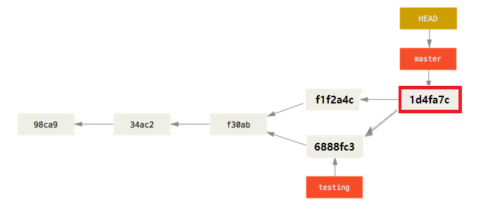


## 브랜치&머지 예제
- 상황
    - 새 기능 추가용 브랜치(iss53)에서 새로운 기능을 추가하고 있는 중
    - 갑자기 제품에 버그 발생/긴급 수정 필요
- 해결
    - 마스터(master) 브랜치로 변경
        + 여기에서 master 브랜치가 제품 릴리즈용 브랜치라고 가정한 것임
    - 버그 수정용 핫픽스 브랜치(hotfix) 생성
    - 문제 해결 후 핫픽스 브랜치를 마스터로 머지
    - 원래 작업하던 iss53 브랜치로 변경하여 계속 작업


## 브랜치&머지 예제
- Iss53 브랜치를 만들어서 새 기능 추가 작업 상황
    ```
    > git checkout -b iss53
    Switched to a new branch 'iss53'
    > notepad main.c
    > git commit -a -m "Print hello"
    [iss53 C3] Print hello
     1 file changed, 5 insertions(+)
    ```
    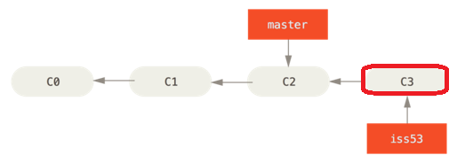
- ``` > git checkout -b iss53 ``` 에서 -b 옵션은 branch를 새로 만들면서 변경함
    - 즉, ``` > git branch iss53 ``` 와 ``` > git checkout iss53 ``` 를 합친 것


## 브랜치&머지 예제
- 제품 버그 수정을 위해 master 브랜치로 변경하고 hotfix 브랜치 생성, 버그 수정
    ```
    > git checkout master
    Switched to branch 'master'
    > git checkout -b hotfix
    Switched to a new branch 'hotfix'
    > notepad main.c
    > git commit -a -m "Add return 1"
    [hotfix C4] Add return 1
     1 file changed, 1 insertion(+), 1 deletion(-)
    ```
    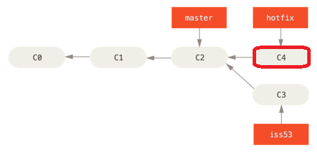


## 브랜치&머지 예제
- 버그 수정한 hotfix 브랜치를 테스트 완료 후 hotfix 브랜치를 master 브랜치로 머지
    ```
    > git checkout master
    Switched to branch 'master'
    > git merge hotfix
    Updating b117ce3..eaa3e91
    Fast-forward
     main.c | 2 +-
     1 file changed, 1 insertion(+), 1 deletion(-)
    ```
    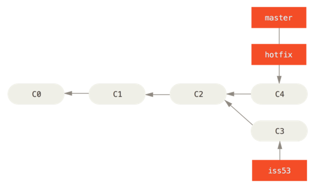


## 브랜치&머지 예제
- 불필요한 hotfix 브랜치를 제거하고 이전에 하던 작업 iss53으로 돌아가서 새 기능 추가 진행
    ```
    > git branch -d hotfix           [-d 옵션은 브랜치 삭제]
    Deleted branch hotfix (was eaa3e91).
    > git checkout iss53
    Switched to branch 'iss53'
    > notepad main.c
    > git commit -a -m "Print world"
    [iss53 C5] Print world
    1 file changed, 1 insertion(+)
    ```
    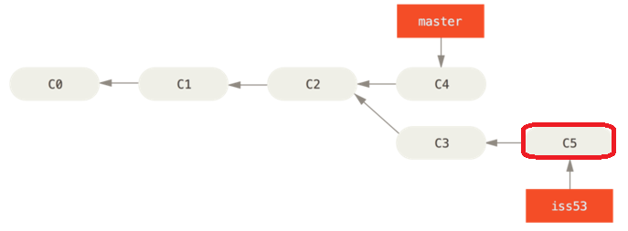


## 브랜치&머지 예제
- 새 기능 추가 iss53 작업을 완료하고 master로 머지 시키기
    ```
    > git checkout master
    Switched to branch 'master'
    > git merge iss53
    Auto-merging main.c
    CONFLICT (content): Merge conflict in main.c
    Automatic merge failed; fix conflicts and then commit the result.
    ```
- 가끔 이렇게 Conflict가 나는 경우가 생김
    - master와 iss53의 공통 커밋 이후에 동일한 부분을 서로 다르게 수정했을 경우 발생
    - 예를 들어 앞의 그림에서 C3와 C4에 동일한 부분을 다르게 수정했다면 발생할 수 있음


## 브랜치&머지 예제
- Conflict 해결
    - 해당 파일을 열어보면 어디에서 conflict가 발생 했는지 확인 가능. 파일 수정하여 해결 후 커밋.  
    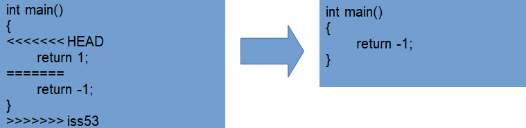
    ```
    > git commit -a
    [master C6] Merge branch 'iss53'
    ```
    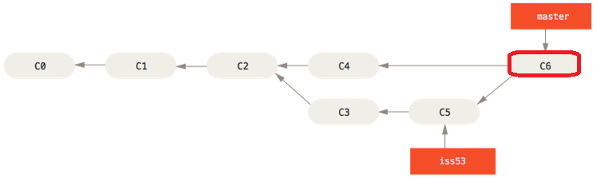

<!--
참고: > git mergetool
-->

## 브랜치&머지 예제
- 브랜치 관리
    ```
    > git branch                         [브랜치를 모두 보여줌]
      iss53
    * master
      testing
    > git branch -v                    [각 브랜치의 마지막 커밋]
      iss53   2f788e8 return -1
    * master  5d9b98a Merge branch 'iss53'
      testing ac33802 test
    > git branch –merged               [현재 브랜치에 머지된 것만 보여줌]
      iss53
    * master
    > git branch –no-merged            [현재 브랜치에 머지 안된 것만]
      testing
    > git branch -d testing            [머지가 안된 브랜치는 삭제 안됨]
    error: The branch 'testing' is not fully merged.
    If you are sure you want to delete it, run 'git branch -D testing'.
    ```


## 브랜치 합치기 Rebase
- Git에서 한 브랜치에서 다른 브랜치로 합치는 방법
    - Merge
    - Rebase
- Rebase
    - 보다 깨끗한 커밋 히스토리를 만들 수 있음
        + Merge와 달리 불필요한 merge용 커밋을 만들지 않음
        + 선형의 히스토리를 만듬
- 주의 사항
    - **공개 저장소에 이미 Push한 커밋을 Rebase하지 마라**
    

## 브랜치 합치기 Rebase
- Merge  

- Rebase
    ```
    > git checkout testing
    Switched to branch 'testing'
    > git rebase master
    First, rewinding head to replay your work on top of it...							
    Applying: Add test.c
    ```
    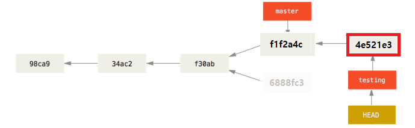


## 브랜치 합치기 Rebase
- master를 Fast-forward시키면 합치기 끝
    ```
    > git checkout master
    Switched to branch 'master'
    > git merge testing
    Updating f1f2a4c..4e521e3
    Fast-forward
    test.c | 0
    1 file changed, 0 insertions(+), 0 deletions(-)
    create mode 100644 test.c
    ```
    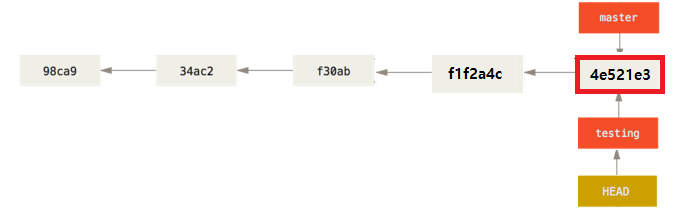


## 브랜치 합치기 Rebase
- Rebase는 말 그대로 base를 바꾼다는 뜻.
- 현재 브랜치에서 새로 만든 커밋들을 rebase할 대상 브랜치의 커밋들로 옮겨 놓는 것


## Stash
- Commit을 하긴 좀 부족하고, 다른 브랜치 작업은 해야겠고.
- Stash는 Modified이면서 Tracked 상태인 파일과 Staged 상태인 파일들을 보관해두는 장소
    - Staged 상태 파일들은 복구될 때 Staging Area에서 내려감
- 아직 끝나지 않은 수정사항을 스택에 잠시 저장했다가 나중에 다시 적용할 수 있음
    ```
    > git status
    On branch master
    Changes not staged for commit:
            modified:   test.c
    > git stash             [Commit하지 않은 파일들을 보관]
    Saved working directory and index state WIP on master: 30b027d test2
    > git stash apply       [보관한 파일들을 복구]
    On branch master
    Changes not staged for commit:
            modified:   test.c
    > git stash drop        [보관 장소 제거]
    Dropped refs/stash@{0} (ecab01f27fc7a47b8a1994e400e4cb48ba49f195)
    ```

## Exercise 1 - Online Exercise
- https://learngitbranching.js.org/


## Exercise 2 - Branch, Merge, Conflict
- 저장소 새로 만들기
- index.html 파일 생성/commit
- index.html에 간단한 자기 소개 html 작성/commit
- 브랜치 food 생성/변경
- food.html(좋아하는 음식) 작성/commit
- index.html에서 food.html 링크 추가/commit
- 브랜치 master로 변경
- index.html 적당히 수정/commit
- food 브랜치를 master로 merge
- conflict가 발생한다면 이를 해결하고 commit
- food 브랜치 삭제


## Exercise 3 - Branch, Rebase
- 저장소 새로 만들기
- main.c 파일 생성/commit
- main.c 에 변경이력을 5개정도 임의로 작성
- git tag로 v1.0이라고 태깅
- main.c 에 변경이력 3개 정도 임의로 추가
- v1.0 태그에 브랜치 bugfix 만들기
- bugfix 로 브랜치 변경
- main.c 수정하여 변경이력 2개 정도 임의로 추가
- bugfix 브랜치를 master로 rebase
- GUI 프로그램으로 히스토리 살펴보기


