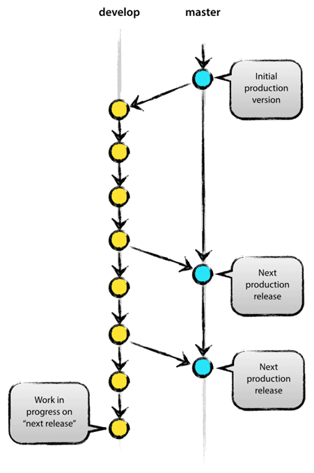
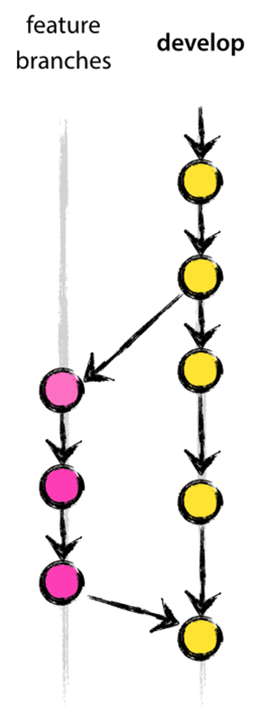
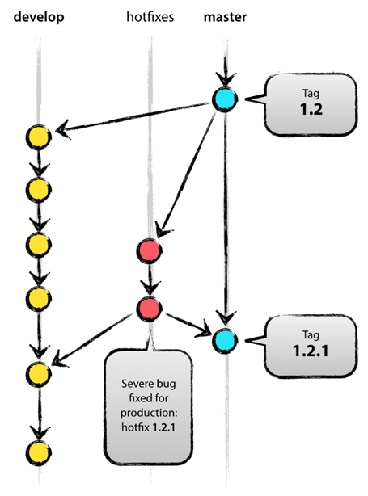

# Git Flow
<!-- _class: lead -->
### 허준영(jyheo@hansung.ac.kr)

## git-flow
- Vincent Driessen 이 제안한 git branch 모델을 쉽게 사용하도록 만든 툴
- Gitlab-Flow나 Github-flow도 있음
- 메인 브랜치(infinite lifetime)
    - master
    - develop 
- Supporting Branch (limited lifetime)
    - Feature
    - Release
    - Hotfix

출처: http://nvie.com/posts/a-successful-git-branching-model/

## 메인 브랜치
- origin/master
    - HEAD는 출시 가능 상태의 제품
- origin/develop
    - HEAD는 다음 제품 출시를 위한
    - 제품 출시 상태만큼 안정화 되면 master로 합쳐지고
     master에 태깅




## Supporting 브랜치
- Feature 브랜치
    - Topic 브랜치라고 하는 경우도 있음
    - 새로운 기능 추가를 위해 develop로부터  파생됨
    - 결국엔 develop으로 합쳐지거나 버려짐




## Supporting 브랜치
- Release  브랜치
    - Develop 브랜치에서 다음 제품을 위한 기능이 추가가 되고 안정화가 되면 release 브랜치를 만듬
    - Release 브랜치에서는 릴리즈에 필요한 파일 수정 등을 하게 됨
    - 최종적으로 master와 develop으로 합쳐짐
    - 그리고 master에 버전 번호를 tag함


## Supporting 브랜치
- Hotfix 브랜치
    - 치명적 버그로 인해 출시된 제품에 수정을 해야 할 경우
    - Master 브랜치에서 만듬
    - 버그 수정 후 master와 develop 브랜치로 합쳐짐
        - 단 release 브랜치가 있는 상황에서는 develop이 아니라 release로 합침
    - master에는 버전 번호를 tag함



## git-flow 설치
- Linux(ubuntu)
    - ``` $ apt install git-flow ```
- Windows
    - Git for windows를 설치하면 자동으로 설치됨
- Mac OS X
    - ``` $ brew install git-flow-avh ```


## git-flow init
- ``` $ git flow init ``` (이미 존재하는 저장소에서 해도 됨)
```
$ git flow init

Which branch should be used for bringing forth production releases?
   - master
Branch name for production releases: [master] 
Branch name for "next release" development: [develop] 

How to name your supporting branch prefixes?
Feature branches? [feature/] 
Bugfix branches? [bugfix/] 
Release branches? [release/] 
Hotfix branches? [hotfix/] 
Support branches? [support/] 
Version tag prefix? [] 
Hooks and filters directory? [/home/jyheo/gitflow_test/.git/hooks] 
$ git branch
* develop
  master
```

## Feature
- 기능 추가 브랜치 시작
    - ``` $ git flow feature start [기능 이름] ```
```
$ git flow feature start export_as_pdf
Switched to a new branch 'feature/export_as_pdf'

Summary of actions:
- A new branch 'feature/export_as_pdf' was created, based on 'develop'
- You are now on branch 'feature/export_as_pdf'

Now, start committing on your feature. When done, use:

     git flow feature finish export_as_pdf
```

## Feature
- 기능 추가 완료
```
$ touch export_pdf.c
$ git add export_pdf.c 
$ git commit -m "export pdf"
[feature/export_as_pdf bfae7f3] export pdf
 1 file changed, 0 insertions(+), 0 deletions(-)
 create mode 100644 export_pdf.c
$ git flow feature finish export_as_pdf
Switched to branch 'develop'
Updating cee6458..bfae7f3
Fast-forward
 export_pdf.c | 0
 1 file changed, 0 insertions(+), 0 deletions(-)
 create mode 100644 export_pdf.c
Deleted branch feature/export_as_pdf (was bfae7f3).

Summary of actions:
- The feature branch 'feature/export_as_pdf' was merged into 'develop'
- Feature branch 'feature/export_as_pdf' has been locally deleted
- You are now on branch 'develop'
```

## Release
- 릴리즈 준비 시작
    - ``` $ git flow release start [버전 번호] ```
```
$ git flow release start 0.1
Switched to a new branch 'release/0.1'

Summary of actions:
- A new branch 'release/0.1' was created, based on 'develop'
- You are now on branch 'release/0.1'

Follow-up actions:
- Bump the version number now!
- Start committing last-minute fixes in preparing your release
- When done, run:
     git flow release finish '0.1'

$ git branch
  develop
  master
* release/0.1
```

## Release
- 릴리즈 완료
```
$ echo "0.1" > VERSION
$ git flow release finish 0.1
Switched to branch 'master'
Merge made by the 'recursive' strategy.
 export_pdf.c | 0
 1 file changed, 0 insertions(+), 0 deletions(-)
 create mode 100644 export_pdf.c
Deleted branch release/0.1 (was bfae7f3).

Summary of actions:
- Release branch 'release/0.1' has been merged into 'master'
- The release was tagged '0.1'
- Release tag '0.1' has been back-merged into 'develop'
- Release branch 'release/0.1' has been locally deleted
- You are now on branch 'develop'
```
- ※ Merge와 Tag로 인해 커맨트를 쓰기 위한 에디터가 뜰 수 있음. 충실히 쓰고 에디터 종료!


## Exercise 1 (2인이상 함께 실습)
- 조장이 github에 repository (이름: git-flow-test)를 하나 만든다.
- 조원 각자 로컬 컴퓨터에서 
    - $ git clone https://github.com/아이디/git-flow-test.git
    - $ cd git-flow-test
    - $ git flow init
    - $ git flow feature start new_feature
    - 자신의 이름으로 파일을 하나 생성(james.c)/commit
    - $ git flow feature finish new_feature
    - $ git flow release start 0.1
    - $ james.c 수정 /commit
    - $ git flow release finish 0.1
    - $ git push -u origin develop      (develop 브랜치를 github으로 올리면서 origin/develop을 트래킹)
    - $ git push origin master
    - $ git pull   (오류가 나면 잘 살펴보고 해결, 트래킹을 설정하라는 얘기를 찾아볼 것)         


## Publish & Track
- feature/release/hotfix 브랜치를 원격지로 보내기
    - ``` $ git flow feature publish iss55 ```
    ```
    Summary of actions:
    - The remote branch 'feature/iss55' was created or updated
    - The local branch 'feature/iss55' was configured to track the remote branch
    - You are now on branch 'feature/iss55'
    ```
- 원격지의 feature/release/hotfix 브랜치를 트래킹
    - ``` $ git flow feature tack iss55 ```
    ```
    Branch feature/iss55 set up to track remote branch feature/iss55 from origin.
    Switched to a new branch 'feature/iss55'
    
    Summary of actions:
    - A new remote tracking branch 'feature/iss55' was created
    - You are now on branch 'feature/iss55'
    ```

## Exercise 2 (2인이상 함께 실습)
- 조장이 github에 repository (이름: git-flow-test)를 하나 만든다.
조원 각자 로컬 컴퓨터에서
    - $ git clone https://github.com/아이디/git-flow-test.git
    - $ cd git-flow-test
    - $ git flow init
    - $ git flow feature start james
        - Feature 이름은 각자 맘에 드는 이름으로 하나씩 만든다. 여기에서는 james
    - james.c 파일 생성/commit (feature 이름과 같은 c파일)
    - $ git flow feature publish james
    - james.c 파일을 수정/commit
    - $ git flow feature publish new_feature
    - github에 들어가서 어떤 feature/ 들이 있는지 본다. 자신의 것(james)을 제외하고 다른 사람 것을 고른다.(john)
    - $ git flow feature track john
    - John2.c 파일을 만든다.
    - $ git flow feature publish john


## Exercise 2 (계속)

- 모든 조원이 여기까지 완료 후에 $ git pull 하여 다른 사람이 추가한 파일을 확인한다.
- $ git flow feature finish james   (내가 만든것 finish, 원격지 브랜치도 지워짐)
- $ git flow feature finish john     (다른 사람이 만든 것 finish, 원격지가 다른 사람에 의해 이미 지워졌다면 오류, 다시 한번더 수행)


# Q&A
<!-- _class: lead -->