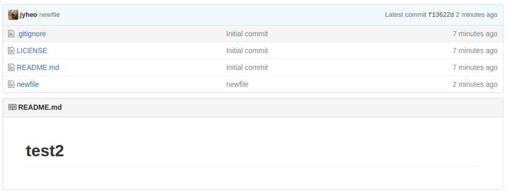

# Git 원격 저장소
<!-- _class: lead -->
### Github
### 허준영(jyheo@hansung.ac.kr)


## 원격 저장소
* 공동 작업을 위해서는 공유 가능한 원격 저장소가 필요
* git을 이용하여 원격 저장소에 접근하는 방법
* $ git remote
	```bash
	$ `git remote -v`
	origin	https://github.com/jyheo/test (fetch)
	origin	https://github.com/jyheo/test (push)
	```
* git clone을 한 경우 origin이란 이름으로 원격 저장소가 지정됨


## 원격 저장소
* 원격 저장소 추가
	- ``` $ git remote add [원격 이름] [원격지 주소] ```
	```bash
	$ mkdir tmp
	$ cd tmp
	$ ls
	$ `git init`
	Initialized empty Git repository in /home/jyheo/tmp/.git/
	$ `git remote add origin https://github.com/jyheo/test`
	$ `git fetch origin`
	remote: Counting objects: 46, done.
	remote: Total 46 (delta 0), reused 0 (delta 0), pack-reused 46
	Unpacking objects: 100% (46/46), done.
	From https://github.com/jyheo/test
	* [new branch]      master     -> origin/master
	* [new branch]      new        -> origin/new
	$ ls
	$ `git checkout master`
	Branch master set up to track remote branch master from origin.					
	Already on 'master'
	$ ls
	LICENSE  README.md  fork_pull_request.c
	```


## 원격 저장소
* 원격 저장소에 로컬 저장소 내용 보내기
	- ``` $ git push [원격 이름] [브랜치 이름] ```
	```bash
	$ `git add tmp`
	$ `git commit -m "test"`
	[master 6d4b5d8] test
		1 file changed, 0 insertions(+), 0 deletions(-)
		create mode 100644 tmp
	$ `git push origin master`
	Username for 'https://github.com': jyheo
	Password for 'https://jyheo@github.com':
	Counting objects: 3, done.
	Delta compression using up to 4 threads.
	Compressing objects: 100% (2/2), done.
	Writing objects: 100% (3/3), 262 bytes | 0 bytes/s, done.
	Total 3 (delta 1), reused 0 (delta 0)
	remote: Resolving deltas: 100% (1/1), completed with 1 local objects.
	To https://github.com/jyheo/test
		aaff3db..6d4b5d8  master -> master
	```


## 원격 저장소
* 원격 저장소에서 최근 내용 가져오기
	- ``` $ git fetch [원격_이름] ```
	```bash
	$ `git fetch origin`
	remote: Counting objects: 5, done.
	remote: Compressing objects: 100% (3/3), done.
	remote: Total 5 (delta 3), reused 4 (delta 2), pack-reused 0 					
	Unpacking objects: 100% (5/5), done.
	From https://github.com/jyheo/test
		6d4b5d8..d0b5c28  master     -> origin/master
	```
* 가져온 내용을 로컬 작업 디렉터리 내용과 합치기
	- ``` $ git merge [원격_이름] ```
	```bash
	$ `git merge origin`
	Updating 6d4b5d8..d0b5c28
	Fast-forward
		README.md | 3 +--
		tmp       | 0
		2 files changed, 1 insertion(+), 2 deletions(-)					
		delete mode 100644 tmp
	```


## Github
* 오픈 소스를 위한 최고의 원격 저장소

* 비슷한 사이트
	- Bitbucket.org, gitlab.com


## Github 저장소 만들기
* Github에 계정을 만들고
	- 있다면 로그인하고
* [New repository] 녹색 버튼을 클릭
	


## Github 저장소 만들기


## Github 저장소 만들기


## Github 저장소 Clone
* Git clone할 원격 주소 알아오기  

* Git clone
	- ``` $ git clone https://github.com/jyheo/test2.git ```
	```bash
	$ `git clone https://github.com/jyheo/test2.git`
	Cloning into 'test2'...
	remote: Counting objects: 5, done.
	remote: Compressing objects: 100% (4/4), done.
	remote: Total 5 (delta 0), reused 0 (delta 0), pack-reused 0					
	Unpacking objects: 100% (5/5), done.
	Checking connectivity... done.
	$ ls test2
	LICENSE  README.md
	```


## Github 저장소로 Push
* ``` $ git push origin master ```
	```bash
	$ `git add newfile`
	$ `git commit -m "newfile"`
	[master f13622d] newfile
	 1 file changed, 0 insertions(+), 0 deletions(-)
	 create mode 100644 newfile
	$ `git push origin master`
	 `Username` for 'https://github.com': jyheo
	 `Password` for 'https://jyheo@github.com':
	Counting objects: 3, done.
	Delta compression using up to 4 threads.
	Compressing objects: 100% (2/2), done.
	Writing objects: 100% (3/3), 263 bytes | 0 bytes/s, done.
	Total 3 (delta 1), reused 0 (delta 0)
	remote: Resolving deltas: 100% (1/1), completed with 1 local objects.				
	To https://github.com/jyheo/test2.git
	   cbb2988..f13622d  master -> master
	```
* **주의**
	- 여기에서 Username, Password는 github ID와 패스워드
	- git의 user.name, user.email과는 전혀 관련 없음!


## Github 저장소로 Push
* Github/test2에 newfile 추가된 것 확인



## Github Pull Request
* 권한이 없는 다른 사용자의 저장소에 변경 요청을 하는 것.
	- 화면 오른쪽 위 Fork 버튼 (현재 로그인 ID: jyheo-st)


## Github Pull Request
* jyheo/test를 Fork하여 나(jyheo-st)의 저장소로 복제해 옴


## Github Pull Request
* 저장소 파일 변경
	- git을 이용하여 로컬로 가져와서 변경 후 push
	- 또는 웹에서 바로 편집 가능
	- New pull request 버튼, Create Pull Request
	


## Github Pull Request
* **jyheo로 로그인하면** 아래와 같은 Pull request


## Github 공동 작업 초간단 시나리오
* A가 오픈 소스 프로젝트 저장소 ‘bestsw’를 만들어 둔 상황
* B가 ‘bestsw’가 마음에 들어서 사용하다가 수정을 할 필요가 생겼음
* B는 Github의 ‘bestsw’ 저장소를 자신의 저장소로 fork해옴
* Fork한 ‘B/bestsw’를 수정
* 수정한 내용을 반영해달라고 A에게 pull request 보냄
* A가 B의 수정 내용을 반영
* A가 생각해보니 B가 프로젝트에 기여를 잘 할 것 같아서 공동 개발자(Collaborators)로 추가함
* 이제부터 B는 직접 ‘bestsw’ 저장소에 수정 할 수 있음


## Exercise
* https://github.com/jyheo/test 를 Fork
* Fork한 저장소를 로컬에 clone
* fork_pull_request.c를 정상 동작하도록 수정
* Commit/Push
* Pull request 생성
* Collaborator가 되면
	- 저장소(https://github.com/jyheo/test)를 clone
	- name 디렉터리 밑에 자신의 id나 이름으로 파일 생성
	- Commit/Push
	- 일정 시간 후에 다른 사람이 변경한 내용 가져오기(fetch/merge)
		```
		$ git fetch origin
		$ git merge origin
		```

