# Git 원격 저장소
<!-- _class: lead -->
### Github
### 허준영(jyheo@hansung.ac.kr)


## 원격 저장소
- 저장소(Repository) 종류
    - 로컬 저장소
    - 원격 저장소
- 공동 작업을 위해서는 공유 가능한 원격 저장소가 필요
    - 원격 저장소를 통해 개인 로컬 저장소의 커밋들을 동기화함
- git이나 ssh를 이용하여 독립 서버를 만들 수도 있겠지만 
- github, gitlab, bitbucket과 같은 원격 저장소 서비스를 많이 이용함
    - 개인 개발자 뿐 아니라 회사에서도 편리하기 때문에 많이 사용함
- 본 강의 자료에서는 github을 기준으로 설명함

## Github
- 오픈 소스를 위한 최고의 원격 저장소

- 비슷한 사이트
    - Bitbucket.org, gitlab.com


## Github 저장소 만들기
- Github에 계정을 만들고 로그인하고
    - 계정을 새로 만든 경우 이메일에서 계정 confirm을 반드시 해야 함
- [New repository] 녹색 버튼을 클릭
    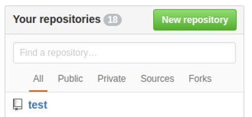


## Github 저장소 만들기
- README, gitignore, license 파일을 같이 생성할 수도 있음
    - **주의:** 기존의 로컬 저장소를 원격 저장소에 넣으려면 이 파일들을 생성하면 안됨!
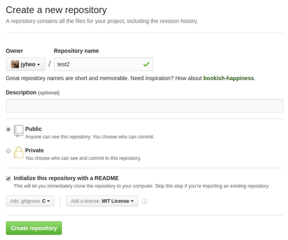

## Github 원격 저장소와 로컬 저장소 **최초** 동기화
- 방법1. 원격 저장소의 내용을 로컬 컴퓨터로 복제(Clone)
    - 원격 저장소 만들 때 README 파일 등 최소 1개 이상의 파일을 함께 생성
- 방법2. 로컬 저장소의 내용을 원격 저장소로 보내기
    - 원격 저장소 만들 때 어떠한 파일도 생성하게 하면 안됨

## 최초 동기화 방법1 - 원격 저장소 생성
- README, gitignore, license 파일을 같이 생성한 경우
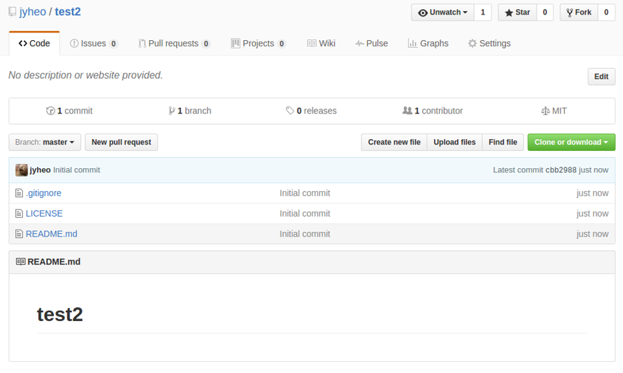


## 최초 동기화 방법1 - 원격 저장소 Clone
- 일반적으로 원격 저장소를 만들고, 로컬 저장소로 복제(clone)하는 것이 간편함
- clone할 원격 주소 알아오기  (github의 경우)
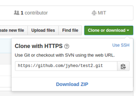
- ``` >git clone [원격 주소] ```
    ```
    > git clone https://github.com/jyheo/test2.git
    Cloning into 'test2'...
    remote: Counting objects: 5, done.
    remote: Compressing objects: 100% (4/4), done.
    remote: Total 5 (delta 0), reused 0 (delta 0), pack-reused 0					
    Unpacking objects: 100% (5/5), done.
    Checking connectivity... done.
    > ls test2                                 [test2라는 폴더가 새로 생성됨]
    Directory: C:\Users\jyheo\test2
    ```

## 최초 동기화 방법2 - 원격 저장소 생성과 로컬 저장소 내용 보내기
- 로컬 저장소가 이미 있는 상황
- 원격 저장소 생성 시 어떠한 파일도 생성되지 않게 함
    - 즉 원격 저장소가 비어 있는 상태
    - 로컬 저장소를 원격 저장소에 넣는 방법
        ```
        > git remote add origin https://github.com/jyheo/test2.git
        > git branch -M master        [현재 브랜치 이름을 master로 변경,
                                         이미 master라면 할 필요 없음]
        > git push -u origin master   [ -u 옵션은 tracking 브랜치 연결을 위해 필요]
        ```
    - remote 명령은 원격 관리
    - push 명령은 로컬 저장소의 지정한 브랜치의 커밋을 원격으로 보냄
        - 이 예에서는 로컬 master 브랜치를 원격 origin의 master 브랜치로 보냄


## 원격 저장소 확인
- ``` > git remote -v ```
    ```
    > git remote -v
    origin  https://github.com/jyheo/test2.git (fetch)
    origin  https://github.com/jyheo/test2.git (push)
    ```
    - fetch 는 원격 저장소에서 로컬로 변경 이력을 가져 오는 것
    - push 는 로컬저장소에서 원격 저장소로 변경 이력을 보내는 것
    - 보통 fetch와 push 주소는 동일하지만, 특별한 경우 다를 수도 있음
        - code review system을 쓰는 경우
    - ``` > git remote add ``` 를 이용하여 원격 저장소를 추가할 수도 있음
- git clone을 한 경우 origin이란 이름으로 원격 저장소가 자동으로 지정됨


## 원격 브랜치 Remote Branch
- ``` > git branch -a ```
    ```
    > git branch -a
    * master
    remotes/origin/HEAD -> origin/master
    remotes/origin/master
    ```
- -a 옵션은 로컬, 원격 브랜치를 모두 표시
- master는 로컬 브랜치
- origin/master는 원격 브랜치


## 원격 브랜치 Remote Branch
- 원격 브랜치는 단순히 원격 저장소의 브랜치를 가리키는 포인터  
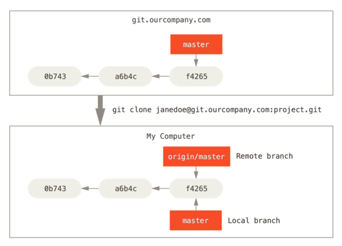

출처: https://git-scm.com/book/en/v2/Git-Branching-Remote-Branches


## 최초 동기화 이후 원격 저장소와 로컬 저장소 동기화
- 동기화는 브랜치 별로 이루어짐
- 로컬 -> 원격
    - 로컬 저장소에서 만든 새 커밋을 보내기(Push)
- 원격 -> 로컬
    - 로컬 저장소에는 없는 원격 저장소의 새 커밋을 가져오기(Fetch)
    - 새로 가져온 원격 브랜치의 커밋을 로컬 브랜치에 합치기(Merge)


## PUSH - 원격 저장소에 로컬 저장소 변경 이력(커밋) 보내기 (1/3)
- ``` > git push [원격 이름] [로컬 브랜치 이름] ```
    - [로컬 브랜치 이름] 으로 지정한 로컬 브랜치를 [원격 이름]에 설정된 원격 저장소의 같은 이름의 브랜치로 보냄
    - 이때 원격 저장소에는 없지만 로컬 저장소에만 있는 새 커밋만 보내게 됨
        - Reject 발생하면 해결 필요!
        - 원격 저장소의 브랜치에 로컬 브랜치에 없는 새로운 커밋이 있을 경우 Reject
        - 새로운 커밋을 먼저 가져와서 합친 후에 다시 시도
            - git fetch/merge 또는 git pull (뒤에 설명)
    - 해당 브랜치가 원격 저장소에 존재하지 않으면 새로 만들게 됨
        - 원격 저장소에 새로 브랜치를 만드는 것은 조심스럽게 해야함
        - 다른 사람과 공유하는 것이기 때문에...


## PUSH - 원격 저장소에 로컬 저장소 변경 이력(커밋) 보내기 (2/3)
- ``` > git push [원격 이름] [로컬 브랜치 이름] ``` 예시
    ```
    > git commit -m "test"        [새 변경 이력 생성]
    [master 4a52752] test
    1 file changed, 1 insertion(+)
    create mode 100644 test.c
    > git status                  [현재 상태 확인]
    On branch master
    Your branch is ahead of 'origin/master' by 1 commit.
    (use "git push" to publish your local commits)

    nothing to commit, working tree clean
    > git push                    [git push 원격 이름과 로컬 브랜치 이름 생략]
    Username for 'https://github.com': jyheo
    Password for 'https://jyheo@github.com':
    Enumerating objects: 4, done.
    Counting objects: 100% (4/4), done.
    Delta compression using up to 16 threads
    Compressing objects: 100% (2/2), done.
    Writing objects: 100% (3/3), 275 bytes | 275.00 KiB/s, done.
    Total 3 (delta 0), reused 0 (delta 0)
    To https://github.com/jyheo/test-repo.git
    2bafe99..4a52752  master -> master
    ```

## PUSH - 원격 저장소에 로컬 저장소 변경 이력(커밋) 보내기 (3/3)
- **주의**
    - 여기에서 Username, Password는 github ID와 Personal Access Token
    - git의 user.name, user.email과는 전혀 관련 없음!
    - Personal Access Token - Github의 사용자 설정에서 생성
        - https://docs.github.com/en/authentication/keeping-your-account-and-data-secure/creating-a-personal-access-token
- git push할 때 원격 이름을 생략하면 default는 origin
- git push할 때 로컬 브랜치 이름을 생략하면 현재 로컬 브랜치
    - 앞의 예에서는 로컬 브랜치 master를 원격 origin/master 브랜치로 push함
    - 즉, ``` > git push origin master ``` 와 동일한 결과
- 보통 원격 이름과 로컬 브랜치 이름을 생략하고 ``` > git push ``` 로 많이 사용
- github 웹으로 접속하여 변경된 내용 확인 가능


## FETCH - 원격 저장소에서 최근 커밋(변경 이력) 가져오기
- 가져오기 전에 먼저 원격 저장소에 로컬 저장소 보다 새로운 커밋이 있어야 함
- github의 경우 웹으로 접속하여 파일을 변경하거나 생성할 수 있음
    - 이 예제에서는 README.md 파일에 "new test"라는 내용의 줄을 추가하여 수정한 것으로 함
- ``` > git fetch [원격_이름] ```
    ```
    > git fetch                  [원격 이름을 생략하면 default는 origin]
    remote: Enumerating objects: 5, done.
    remote: Counting objects: 100% (5/5), done.
    remote: Compressing objects: 100% (2/2), done.
    remote: Total 3 (delta 0), reused 0 (delta 0), pack-reused 0
    Unpacking objects: 100% (3/3), 654 bytes | 43.00 KiB/s, done.
    From https://github.com/jyheo/test-repo
    4a52752..8ef157d  master     -> origin/master
    > cat README.md               [커밋을 가져오기만 하고 로컬 브랜치에 합치지는 않음]
    test
    ```

## MERGE - 원격 저장소에서 가져온 커밋을 로컬 브랜치와 합치기
-  ``` > git merge [브랜치이름] ```
    ```
    > git merge origin/master
    > git merge                  [브랜치이름 생략하면 현재 브랜치의 트래킹 브랜치]
    Updating 4a52752..8ef157d
    Fast-forward
    README.md | 1 +
    1 file changed, 1 insertion(+)
    > cat README.md
    test                       [합쳐진 결과로 한줄 추가된 것이 확인 됨]
    new test
    ```

## PUSH - Reject
- 내가 clone한 이후에 원격 저장소에 누군가 commit(31b8e, 190a3)을 push하였고, 나는 로컬 저장소에 commit(a38de, 893cf)을 수행하였음
    - 이 상황에서 push하면 reject 발생
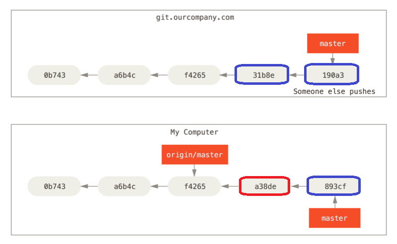


## PUSH - Reject 해결 : Fetch + Merge
- git fetch origin
	- 원격지 origin의 최신 내용(커밋)을 가져옴  
	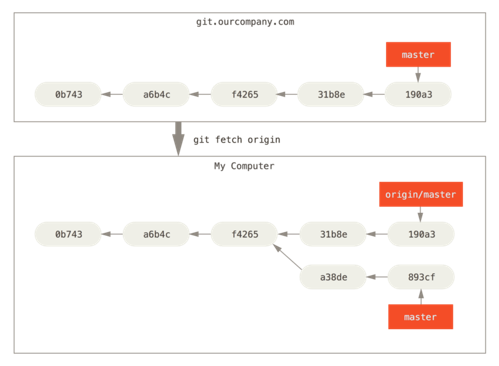
- 현재 브랜치(여기에서는 master)에 원격지 브랜치를 merge
	- ``` > git merge origin/master ```
- 다시 push 시도


## PULL = Fetch + Merge
- 로컬 브랜치가 원격 브랜치의 트래킹 브랜치로 되어 있는 경우
    - git fetch와 merge를 pull 명령어 한번으로 해결
    - git pull은 git fetch & git merge 와 같음
- git push를 할 때 원격 저장소의 내용이 로컬 보다 더 최신 내용이라서 push가 reject될 때가 종종 있음
    - 이런 경우 git push를 하기 전에 보통 git pull을 먼저 하고 git push를 해야 함


## 원격 저장소 브랜치의 트래킹(tracking) 브랜치
- 트래킹한다는 것은 로컬 브랜치가 특정 원격 브랜치와 연결됨을 의미
    - pull할 때 연결된 원격 브랜치로 pull함
- 트래킹 브랜치 연결
    - git push -u origin master 할 때 -u 옵션 사용
        - 로컬 브랜치 master는 원격 브랜치 master의 트래킹 브랜치가 됨
    - git clone으로 로컬 저장소를 만든 경우, 트래킹 브랜치가 자동으로 지정됨
- 트래킹 브랜치 확인 ``` > git branch -vv ```
    ```
    > git branch -vv
    * master 4a52752 [origin/master] test
    ```
    - 로컬의 master 브랜치가 원격 origin의 master 브랜치를 트래킹하고 있음


## git pull --rebase = fetch + rebase
- merge 대신 rebase를 사용하는 방법
- git checkout master
- git rebase origin/master


## Exercise 1
- Github에 저장소를 test라고 만든다. 이때 README, gitignore, LICENSE도 모두 생성
- git clone하여 로컬 컴퓨터로 복제
- 로컬에서 test.c 파일 추가/commit
- test.c 파일을 적당히 수정/commit
- git push
- Github 웹 인터페이스로 test.c를 수정/commit
- 로컬에서 test.c 파일을 수정/commit
- git push 시도, Reject 발생
- git pull 후에 git push 시도
- 로컬 저장소의 히스토리와 github에서의 히스토리 살펴보기


## 브랜치 공유 - 로컬 브랜치 Push
- 브랜치를 원격지에 올려서 공유하기
	```
	> git branch testing                                [로컬 브랜치]
	> git checkout testing
	Switched to branch 'testing'
	> echo "" > testfile
	> git add testfile
	> git commit -m "testfile added"
	[testing daf25d2] testfile added
	 1 file changed, 0 insertions(+), 0 deletions(-)
	 create mode 100644 testing
	> git push -u origin testing                           [원격지 origin에 testing 브랜치 push]
	Username for 'https://github.com': jyheo
	Password for 'https://jyheo@github.com':
	Counting objects: 3, done.
	Delta compression using up to 4 threads.
	Compressing objects: 100% (2/2), done.
	Writing objects: 100% (3/3), 271 bytes | 0 bytes/s, done.
	Total 3 (delta 1), reused 0 (delta 0)
	remote: Resolving deltas: 100% (1/1), completed with 1 local objects.
	To https://github.com/jyheo/test.git
	 * [new branch]      testing -> testing
	```

## 브랜치 공유 - 로컬 브랜치 Push
- 원격지에 새로 testing 브랜치가 push된 것을 확인
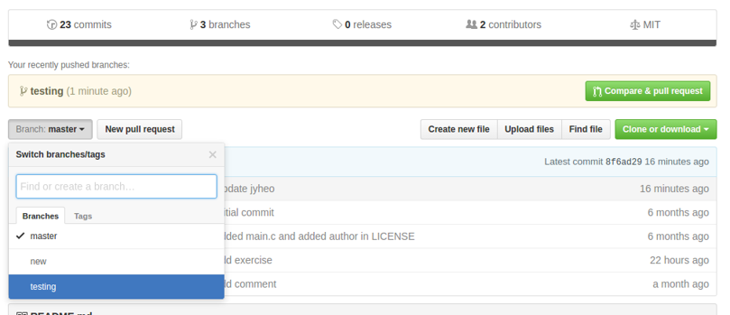


## 브랜치 공유 - 원격 저장소 브랜치 로컬로 가져오기
- 트래킹 브랜치
	- 원격지의 브랜치로 작업하기
- ``` > git checkout -b [로컬 브랜치] [원격 브랜치] ```
	```
	> git fetch origin         [원격 저장소 내용 최신으로 가져오기]
	> git branch -a
	* master
	  remotes/origin/HEAD -> origin/master
	  remotes/origin/master
	  remotes/origin/new
	  remotes/origin/testing
	> git checkout -b testing origin/testing
	Branch testing set up to track remote branch testing from origin.
	Switched to a new branch 'testing'
	> git branch -vv                [트래킹 브랜치 확인]
	  master  8f6ad29 [origin/master] Update jyheo
	* testing 16fbdb2 [origin/testing] hello
	```

## Exercise 2
- Exercise 1에서 만든 원격 저장소 계속 사용
- 로컬에 두 개의 복제를 생성, 서로 다른 디렉토리에 git clone을 수행
- 한 로컬 저장소에서 브랜치 testing 생성
- testing 브랜치 사용
- new.c 파일 생성/commit
- testing 브랜치 원격으로 push, 이때 트래킹 브랜치가 되도록 -u 옵션 사용
- github에서 testing 브랜치 확인
- 다른 로컬 저장소에서 github에 올라온 testing 브랜치 가져오기
- 가져온 testing 브랜치로 사용
- new.c 파일이 작업 디렉토리에 보임을 확인


## Github Pull Request
- Pull Request의 용도
1. 권한이 없는 다른 사용자의 저장소에 변경 요청
    - 먼저 다른 사용자의 저장소를 fork
    - fork된 저장소에 수정 하고
    - Pull Request를 요청
2. 브랜치를 만들고, 브랜치를 main에 merge하기 위해 다른 공동 작업자에게 요청
    - 공동작업자는 코드를 리뷰하고 main에 merge할지 결정
    - main 브랜치로만 merge됨

## Github Pull Request
- 권한이 없는 다른 사용자의 저장소에 변경 요청
- 화면 오른쪽 위 Fork 버튼 (현재 로그인 ID: jyheo-st)
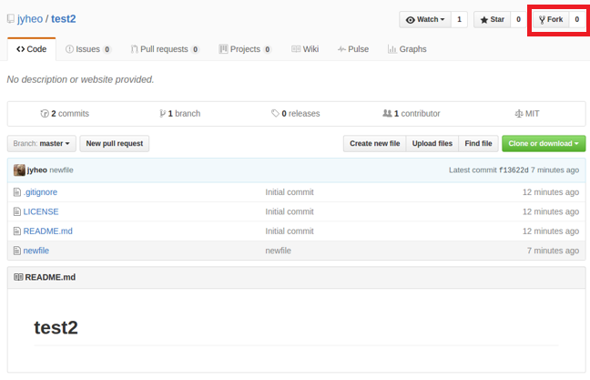


## Github Pull Request
- jyheo/test를 Fork하여 나(jyheo-st)의 저장소로 복제해 옴
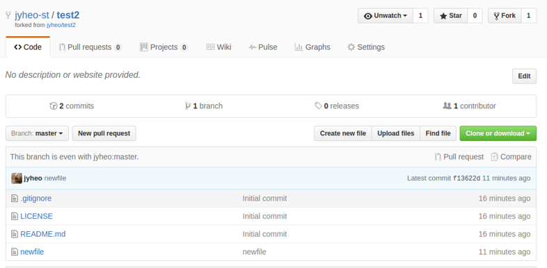


## Github Pull Request
- 복제된 저장소(jyheo-st/test) 파일 변경
    - git을 이용하여 로컬로 가져와서 변경 후 push
    - 또는 웹에서 바로 편집 가능
    - New pull request 버튼, Create Pull Request
    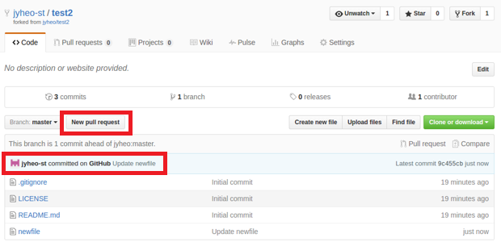


## Github Pull Request
- **jyheo로 로그인하면** 아래와 같은 Pull request
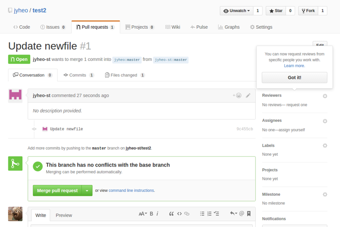


## Sync a Fork
- Fork한 저장소의 내용을 원본(upstream) 저장소의 최신 내용과 동기화 하기
    - 원본 저장소와 fork한 저장소에 새로 만든 커밋을 비교하여 merge하거나 discard하여 sync 수행
    - 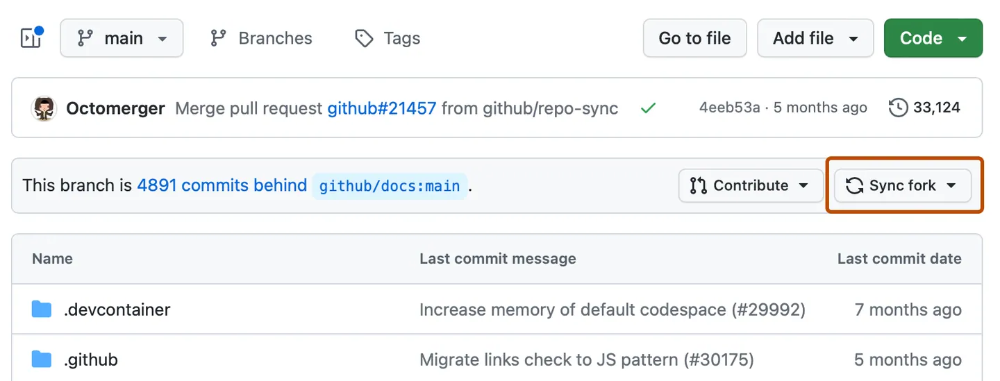


## Exercise 3
- https://github.com/jyheo/test 를 Fork
- Fork한 저장소를 로컬에 clone
- fork_pull_request.c를 정상 동작하도록 수정
- Commit/Push
- Pull request 생성
- Collaborator가 되면
    - 저장소(https://github.com/jyheo/test)를 clone
    - name 디렉터리 밑에 자신의 id나 이름으로 파일 생성
    - Commit/Push
    - 일정 시간 후에 다른 사람이 변경한 내용 가져오기(fetch/merge)
        ```
        > git pull
        ```

