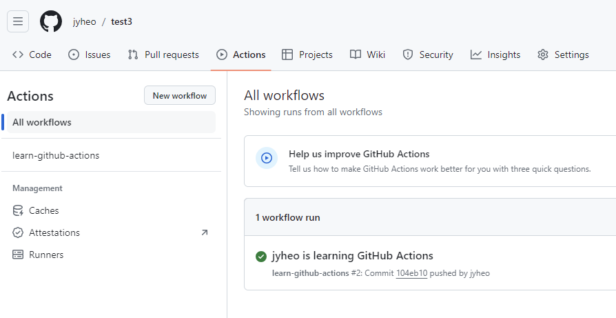
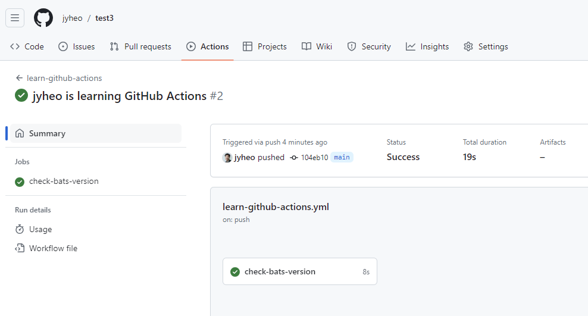
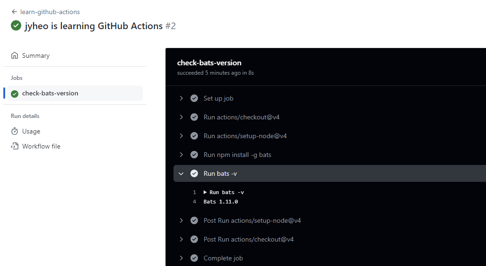
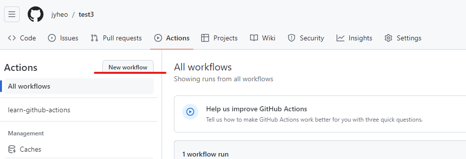
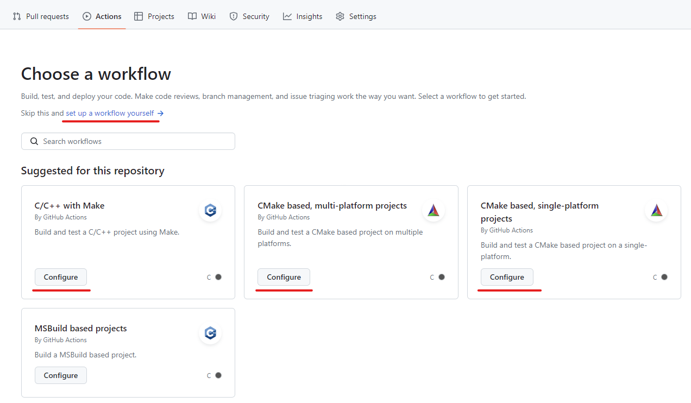
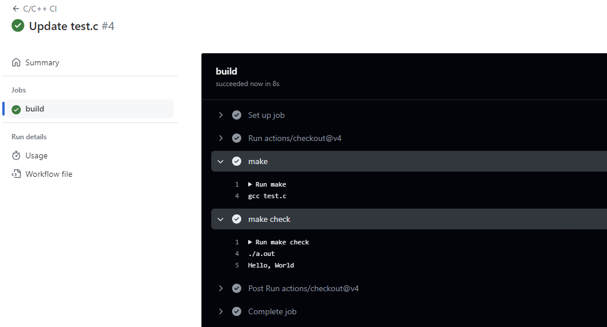
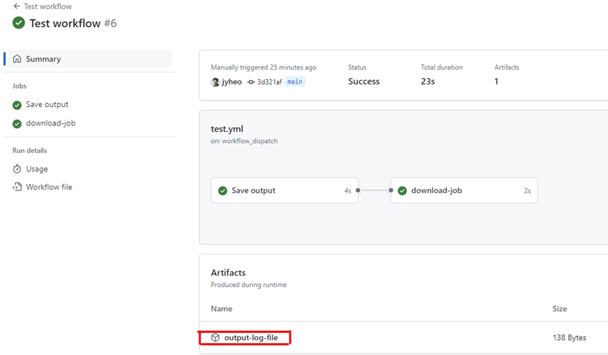
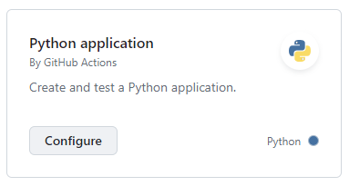
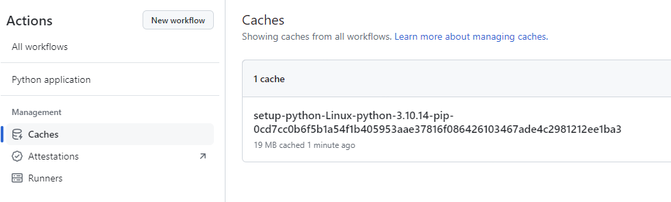

# Github Actions
### CI/CD
<!-- _class: lead -->
### 허준영(jyheo@hansung.ac.kr)

## CI(Continuous Integration) & CD(Continuous Delivery)
- Continuous Integration
    - 지속적으로 퀄리티 컨트롤을 적용하는 프로세스를 실행
    - 기존 통합 방식의 문제점:
        - 원격 저장소에서 코드를 pull해서 작업을 오래하면
        - 언젠가는 저장소가 pull 했을 때와 너무 많이 달라지게 됨
        - 작업하는 시간보다 작업 내용을 통합하는데 걸리는 시간이 더 걸리게 되는 ‘통합의 지옥’이 발생
    - 지속적 통합은 ‘통합 지옥’이 생기지 않도록 자주 통합
- Continuous Delivery
    - 빌드, 테스트 뿐 아니라 배포까지 자동화
- DevOps (개발과 운영을 함께)를 위한 기반 플랫폼
- CI/CD 도구
    - (클라우드) Github Actions, Travis-CI 
    - (설치형) Jenkins

## Github Actions
- Gihub에서 제공하는 CI/CD 플랫폼
- 빌드, 테스트, 배포를 자동화하는 workflow를 만들어 사용
- 예를 들어, 저장소(repository)로 push 할 때마다 빌드와 테스트하는 workflow를 동작시킴
- workflow를 Github에서 제공하는 리눅스, 윈도우, MacOS 가상 머신에서 동작시키거나 자신의 데이터 센터나 다른 클라우드에서도 동작 가능
- Workflow
    - push나, pull request, issue 생성과 같은 이벤트에 의해 자동 실행되는 workflow를 정의
    - 순차 또는 병렬로 실행 가능한 하나 이상의 작업으로 구성됨
    - 각 작업은 가상 머신이나 컨테이너에서 수행되며, 미리 정의된 스크립트나 액션(action)을 실행


## Workflows
- YAML 형식 파일로 작성, 저장소에 포함
- 이벤트 발생할 때 자동 실행되거나 스케줄에 따라 실행
- 직접 실행도 가능
- 저장소의 .github/workflows 에 저장
- 여러개의 workflows 저장 가능
    - pull request 마다 빌드와 테스트를 수행
    - release가 생성될 때마다 배포하는 작업 수행
    - 새 이슈를 생성할 때마다 레이블 추가 수행
- 다른 workflow에서 참조도 가능

## Events
- Workflow를 시작하는 트리거 역할을 하는, 저장소와 관련된 활동
- 예)
    - 누군가 pull request를 생성
    - 이슈를 생성
    - 저장소에 커밋을 push
- 스케줄에 따라 트리거를 동작시키거나 REST API를 통하거나 직접 트리거 동작 가능

## Jobs
- 동일한 runner에서 실행되는 workflow에서의 단계(step)들의 집합
- 각 단계는 스크립트나 액션이 될 수 있음
- 각 단계는 순서대로 수행되거나 다른 단계에 의존되어 수행 될 수 있음
- 동일한 runner에서 수행되기 때문에 다른 단계와 데이터 공유가 가능
    - 예를 들어 빌드 단계의 결과물을 이용해 테스트 단계에서 사용

## Actions
- 액션(action)은 Github Actions 플랫폼에서 복잡하지만 자주 사용되는 태스크를 수행하는 커스텀 응용
- workflow에서 액션을 사용함으로써 반복되는 코드를 줄일 수 있음
- 액션의 예
    - Github에서 pull 하기
    - 빌드 환경에 맞게 툴체인 셋업하기
    - 클라우드에 접근하기 위해 인증 셋업하기
- 직접 액션을 만들 수도 있고, Github Marketplace에서 적절한 액션을 골라 사용할 수 있음.
- https://github.com/marketplace?type=actions

## Runners
- workflows를 실행하는 서버
- 각 runner는 한번에 하나의 job을 실행
- Github에서 제공하는 가상 머신: Ubuntu Linux, Microsoft Windows, macOS
- workflow는 새로 만들어진 가상 머신에서 수행됨
- 특별한 설정의 시스템의 runner가 필요하면 직접 호스팅한 시스템을 사용할 수 있음.

## Workflow - 정리하면...
- Workflow는 어떤 이벤트(on)에 의해 실행될지, 어떤 작업(jobs)을 실행할지, 어떤 서버(runs-on)에서 실행할지 정의한 것
- Workflow는 여러개의 job으로 구성되고
- 각 job은 여러 step으로 구성되고
- 각 step은 action이나 스크립트, 명령어를 실행한다.


## 간단한 Workflow 만들기
- 저장소에 push할 때마다 간단한 workflow를 동작, 이 workflow에서는 bats 테스팅 프레임워크를 설치하고 bats를 실행 (bats -v)
- 테스트용 저장소를 하나 만들고, 그 안에 .github/workflows/ 폴더를 만들고 learn-github-actions.yml 을 추가 (저장소에 commit/push 해야함)
- learn-github-actions.yml 파일의 내용:
 ```yaml
name: learn-github-actions
run-name: ${{ github.actor }} is learning GitHub Actions
on: [push]
jobs:
  check-bats-version:
    runs-on: ubuntu-latest
    steps:
      - uses: actions/checkout@v4
      - uses: actions/setup-node@v4
        with:
          node-version: '20'
      - run: npm install -g bats
      - run: bats -v
 ```

## 간단한 Workflow 만들기
- name: workflow 이름, 저장소의 Actions 탭에 표시됨, 생략하면 파일 이름이 사용됨
- run-name: 실행 중인 workflow 이름, 저장소의 Actions 탭에 표시됨
    - github.actor 는 workflow 트리거시킨 사용자 이름
- on: 트리거 이벤트 정의
    - push, 특정 브랜치나 경로에 대한 push로 한정도 가능
- jobs: job 정의 시작
- check-bats-version: job 이름 정의
    - runs-on : runner 지정
    - steps: 이 job의 단계(step)들
        - -uses: 사전 정의된 액션 사용
        - -run: 명령어 수행
- uses: actions/checkout@v4 - 저장소의 소스를 runner에 checkout
- uses: actions/setup-node@v4 with: node-version: '20' 노드 버전 20을 셋업
- @v4는 액션의 버전을 의미

## 간단한 Workflow 만들기
- Github 저장소에서 Actions 탭을 누르면 생성한 workflow 확인 가능


## 간단한 Workflow 만들기
- 아무 파일이나 수정하고 push하기 (또는 github 사이트에서 파일을 수정하고 commit 해도 됨)
- workflow 실행 결과 확인


## 간단한 Workflow 만들기



## Starter Workflow
- 템플릿에서 workflow 만들기
- Action 탭에서 [New workflow] 클릭하면 템플릿 선택 화면 나타남
    - workflow가 없으면 템플릿 고르는 화면이 바로 나옴



## Starter Workflow



## Starter Workflow
- C/C++ with Make 의 Configure를 선택
```yml
name: C/C++ CI
on:
  push:
    branches: [ "main" ]
  pull_request:
    branches: [ "main" ]
jobs:
  build:
    runs-on: ubuntu-latest
    steps:
    - uses: actions/checkout@v4
    - name: configure   # 이 예제에서 필요 없으므로 삭제
      run: ./configure  # 이 예제에서 필요 없으므로 삭제
    - name: make
      run: make
    - name: make check
      run: make check
    - name: make distcheck  # 이 예제에서 필요 없으므로 삭제
      run: make distcheck   # 이 예제에서 필요 없으므로 삭제
```

## Starter Workflow
- Makefile
```Makefile
all:
	gcc test.c

check:
	./a.out
```
- test.c
```c
#include <stdio.h>

int main()
{
	printf("Hello, World");
	return 0;
}
```

## Starter Workflow
- commit/push 한 후 Actions 결과 확인



## Exercise 1
- Github에 Repository 생성
- git clone
- test.c 파일 생성, 적당한 내용을 출력하도록 작성, commit/push
- Makefile 파일 생성, make all, make test 가능하게
- Actions 탭에서 workflow 생성, C/C++ 템플릿 사용
    - on: [push]
    - step에 make all, make test 수행
- test.c 파일 업데이트, commit/push
- Actions 에서 결과 확인


## uses Actions
- Github의 공개된 다른 저장소에 있는 action 
    - Github Marketplace(https://github.com/marketplace)에 있는 action
    - 형식: {owner}/{repo}@{ref}
    ```yml
     - name: typos-action
       uses: crate-ci/typos@v1.22.7
    ```
    - Github 공식 actions repository는 owner가 actions
- workflow와 같은 저장소에 있는 action
    - **.github/actions**/hello-action/action.yml 과 같이 action 정의된 경우
    ```yml
      - name: Use local hello-action
        uses: ./.github/actions/hello-action
    ```
    - action.yml 정의
        - https://docs.github.com/en/actions/creating-actions/metadata-syntax-for-github-actions
- Docker Hub에 있는 공개된 도커 이미지


## Workflow 에서 job간에 파일 공유 (Artifacts)
- 파일을 Artifacts 로 저장하고 다운로드 하는 action을 이용해 공유
```yml
jobs:
  upload-job:
    name: Save output
    runs-on: ubuntu-latest
    steps:
      - shell: bash
        run: expr 1 + 1 > output.log
      - name: Upload output file      # 로그 파일을 업로드
        uses: actions/upload-artifact@v4
        with:
          name: output-log-file
          path: output.log
  download-job:
    runs-on: ubuntu-latest
    needs: upload-job            # upload-job이 먼저 수행되어야 함
    steps:
      - name: Download a single artifact    # 로그 파일 다운로드
        uses: actions/download-artifact@v4
        with:
          name: output-log-file
      - run: cat output.log
```

## Workflow 에서 환경 변수(Variable) 지정
- workflow, job, step 수준에서 환경 변수 지정
- **env** 키워드로 지정
```yml
env:
  DAY_OF_WEEK: Monday    # workflow 수준 변수
jobs:
  example-job:
    runs-on: ubuntu-latest
    env:
      Greeting: Hello       # job 수준 변수
    steps:
      - name: Run program with Environment variables
        run: node client.js
        env:
          POSTGRES_HOST: postgres  # step 수준 변수
          POSTGRES_PORT: 5432
      - name: "Say Hello Mona it's Monday"
        run: echo "$Greeting $First_Name. Today is $DAY_OF_WEEK!"
        env:
          First_Name: Mona
```

## Workflow 에서 Expression 사용
- 용도
  - 환경 변수 값을 expression 으로 지정
  - step의 실행을 expression 결과에 따라 결정
- expression에서 context 접근이나 간단한 연산, 유용한 함수들을 사용할 수 있음
- https://docs.github.com/en/actions/learn-github-actions/expressions
- 문법: ${{  expression  }}
- 예)
```yml
steps:
  - name: if condition
    run: node client.js
    if: ${{ success() }}  # 앞의 모든 step이 성공일 경우 이 step을 실행
    env:
      MY_ENV_VAR: ${{ 1+1 }}  # 수식으로 환경 변수 값 지정
```

## Expression 에서 Context 사용
- Context는 workflow, 변수, runner, job, step에 대한 정보를 **expression**에서 접근하기 위한 방법
  - 각각에 대한 객체가 정의되어 있고 각 객체에는 여러 속성을 포함
- github : workflow 실행에 대한 정보
  - github.actor : 실행 원인 제공자
  - github.ref : 실행되는 repository branch나 tag 등
- env: workflow에서 정의한 변수
  - env.변수이름 형태로 사용
  - ${{ env.DAY_OF_WEEK }}
- job: 현재 수행중인 job
- steps: 현재 수행중인 job의 step에 대한 정보, step을 구분하기 위해 id를 정의해야 함
- runner: runner에 대한 정보
  - runner.os : 운영체제 정보 (Linux, Windows, macOS)
- 이외에도 secrets, needs(출력), inputs(입력) 등이 있음


## 변수 사용과 Expression에서 변수 사용
- Workflow는 변수를 바로 인식하지 못함
- 변수(환경변수)를 인식하는 프로그램에서는 바로 사용 가능
  - 예) echo "$Greeting $First_Name. Today is $DAY_OF_WEEK!"
- Workflow에서 변수를 사용하려면 Expression에서 사용해야 함
  - 예) name: ${{ env.DAY_OF_WEEK }}


## Context 사용 예
- github context 사용 예시
```yml
name: Run CI
on: [push, pull_request]

jobs:
  normal_ci:
    runs-on: ubuntu-latest
    steps:
      - name: Run normal CI
        run: echo "Running normal CI"

  pull_request_ci:
    runs-on: ubuntu-latest
    if: ${{ github.event_name == 'pull_request' }} # github context 접근
    steps:
      - name: Run PR CI
        run: echo "Running PR only CI"
```

## Exercise 2
- actions/upload-artifact@v4 와 actions/download-artifact@v4를 사용하는 Artifact 예제에서 중복해서 나오는 output 이름과 파일 경로를 변수로 바꿔보기
- output-log-file이 2번, output.log가 3번 나타나는데 이를 대신할 적절한 변수를 정의하고 변수로 바꿔보기
- workflow 결과를 확인하고 Actions 탭에서 생성된 artifact 파일 확인하기
- 주의: Expression으로 쓸지 변수를 바로 사용할 지 잘 판단할 것
- 힌트:
  ```yml
  env:
    OUTPUT_FILE: output.log
    OUTPUT_NAME: output-log-file

  - run: cat $OUTPUT_FILE

  - name: ${{ env.OUTPUT_NAME }}
  ```

## Exercise 2 - 솔루션
```yml
name: Test workflow
on: workflow_dispatch
env:
  OUTPUT_FILE: output.log
  OUTPUT_NAME: output-log-file
jobs:
  upload-job:
    name: Save output
    runs-on: ubuntu-latest
    steps:
      - shell: bash
        run: expr 3 + 1 > $OUTPUT_FILE
      - name: Upload output file
        uses: actions/upload-artifact@v4
        with:
          name: ${{ env.OUTPUT_NAME }}
          path: ${{ env.OUTPUT_FILE }}
  download-job:
    runs-on: ubuntu-latest
    needs: upload-job
    steps:
      - name: Download a single artifact
        uses: actions/download-artifact@v4
        with:
          name: ${{ env.OUTPUT_NAME }}
      - run: cat $OUTPUT_FILE
```

## Exercise 2 - 솔루션
- Actions 탭에서 Artifacts 확인



## Workflow 트리거
- push 이벤트가 발생할 때마다 workflow 시작
  - ``` on: push ```
- pull_request 이벤트
  - ``` on: pull_request ```
- 수동으로 시작하기
  - ``` on: workflow_dispatch ```
  - Actions 탭에서 workflow를 선택하면 [Run workflow] 버튼 생김
- 다른 workflow에서 호출 가능
  - ``` on: workflow_call ```
- 2개 이상 이벤트
  - ``` on: [push, pull_request] ```

## Workflow 트리거
- 이벤트 활동 종류에 따라 workflow 트리거
  ```yml
  on:
    issues:      # 이슈 이벤트
      types:
        - opened   # 이슈가 새로 오픈
        - labeled  # 이슈에 레이블 붙인 경우
  ```
- 특정 브랜치에 따라 workflow 트리거, 또는 제외
  ```yml
  on:
    push:
      branches:
        - main     # main 브렌치
        - 'releases/**'   # release/ 로시작하는 브렌치
        - '!releases/**-alpha'  # release/로 시작하고 -alpha로 끝나는 브렌치는 제외
  ```
- 특정 path, tag에 대해서 필터링할 수도 있음


## Workflow 의 입력과 출력
- workflow_dispatch나 workflow_call 트리거가 있는 경우 입력과 출력을 지정할 수 있음
  - 즉, 수동으로 시작할 때 입력 값을 지정하거나,
  - 다른 workflow를 호출할 때 입력을 주고, 출력을 받을 수 있음
- workflow_dispatch는 input 만
- workflow_call은 input, output 모두 가능


## reusable-workflow.yml
```yml
name: Reusable workflow example
on:
  workflow_call:
    inputs:   # 입력 정의
      input1:
        required: true
        type: string
    outputs:  # 출력 정의
      output1:
        description: "The first output string"
        value: ${{ jobs.example_job.outputs.output1 }}
jobs:
  example_job:
    runs-on: ubuntu-latest
    outputs:
      output1: ${{ steps.step1.outputs.result }}
    steps:
    - id: step1    # input1에 10을 더해서 output result에 기록
      run: echo "result=`expr ${{ inputs.input1 }} + 10`" >> $GITHUB_OUTPUT
```


## Call reusable workflow
- jyheo 계정의 test3 저장소에 있는 reusable-workflow.yml 을 호출
```yml
name: Call a reusable workflow and use its outputs
on:
  workflow_dispatch
jobs:
  job1:
    uses: jyheo/test3/.github/workflows/reusable-workflow.yml@main
    with:
      input1: 10  # 입력 input1 을 10으로 하여 reusable-workflow 실행

  job2:
    runs-on: ubuntu-latest
    needs: job1   # job1이 끝난 후에 수행
    steps:
      - run: echo ${{ needs.job1.outputs.output1 }}  # needs 를 통해 output 접근
```

## Exercise 3
- input으로 문자열 2개를 받은 후 두 문자열을 결합하여 output으로 내보내는 reusable workflow를 만든다.
- 특정 브랜치(release)에 대해 push가 있을 때, 앞에서 만든 reusable workflow를 실행한다.
  - 이때 input으로 문자열 2개를 준다. (Hello, World)
  - output은 echo로 화면 출력한다.


## Cache dependency
- 자주 재사용되는 파일을 캐싱하여 실행 시간을 단축
- Cache는 일반적으로 변하지 않는, 빌드에 필요한 dependecy 등을 저장하기 위한 것
- 비교) Artifact는 실행 결과로 생기는 바이너리 또는 로그와 같이 변경되는 내용을 저장하기 위한 것
- key 에 해당하는 cache가 있으면 복구하고 없으면, job 종류 후 새로 cache를 생성
```yml
steps:
  - name: Cache Gradle packages
    id: cache-gradle
    uses: actions/cache@v3   # cache 액션
    with:
      path: |                # 2라인 이상 작성할 때 | 를 먼저 쓰고 그 다음에 나열함
        ~/.gradle/caches     # cache할 경로
        ~/.gradle/wrapper    # cache할 경로
      key: ${{ runner.os }}-build-${{ hashFiles('a-file') }} # 어떤 파일의 hash 값을 키에 사용
  - if: ${{ steps.cache-gradle.outputs.cache-hit != 'true' }}  # cache-hit 는 캐시 hit 여부
    run echo ${{ steps.cache-gradle.outputs.cache-hit }}
```

## Cache dependency
- 아래 열거된 패키지 매니저를 사용하는 경우 setup- 액션을 사용하면 간편함
- npm, Yarn, pnpm : setup-node
- RubyGems : setup-ruby
- Go go.sum : setup-go
- .NET NuGet : setup-dotnet
- pip, pipenv, Poetry : setup-python
```yml
steps:
- uses: actions/checkout@v4
- uses: actions/setup-python@v5
  with:
    python-version: '3.9'
    cache: 'pip' # caching pip dependencies
- run: pip install -r requirements.txt
```

## Cache dependency
- Gradle, Maven : setup-java
```yml
steps:
- uses: actions/checkout@v4
- uses: actions/setup-java@v4
  with:
    distribution: 'temurin'
    java-version: '21'
    cache: 'gradle'
    cache-dependency-path: | # optional
      sub-project/*.gradle*
      sub-project/**/gradle-wrapper.properties
- run: ./gradlew build --no-daemon
```


## Jobs 활용
- workflow는 1개 이상의 job으로 이루어짐
- 기본적으로 job 들은 병렬로 수행되지만, jobs.<job_id>.needs를 이용해 순서를 정할 수 있음
- 아래는 job1 다음 job2, 그리고 job3가 수행되도록 한 것
  - 단 job1이나 job2에서 오류가 나면 수행되지 않음
```yml
jobs:
  job1:
  job2:
    needs: job1
  job3:
    needs: [job1, job2]
```

## Jobs 활용 - 조건
- Jobs.<job_id>.if
  - if 조건이 true 인 경우만 해당 job이 수행됨
```yml
name: example-workflow
on: [push]
jobs:
  production-deploy:
    if: github.repository == 'octo-org/octo-repo-prod'  # 저장소가 조건에 맞을 때만
    runs-on: ubuntu-latest
    steps:
      - uses: actions/checkout@v4
      - uses: actions/setup-node@v4
        with:
          node-version: '14'
      - run: npm install -g bats
```

## Jobs 활용 - matrix 전략
- Jobs.<job_id>.strategy.matrix
  - matrx에서 정의한 변수의 모든 조합에 대해 해당 job을 수행, (최대 256개)
```yml
jobs:
  example_matrix:
    strategy:
      matrix:
        os: [ubuntu-22.04, ubuntu-20.04]
        version: [10, 12, 14]
    runs-on: ${{ matrix.os }}
    steps:
      - uses: actions/setup-node@v4
        with:
          node-version: ${{ matrix.version }}
```


## Build & Test - Python
- 저장소 만들기
- 다음 파일 추가 (https://github.com/jyheo/github-actions-python-example)
    - str_util.py
    - test_str_util.py
    - np_util.py
    - test_np_util.py
- actions 에서 starter workflow로 python application추가
  - 

## Python
- workflow 파일을 commit/push 하면서 workflow가 동작하지만, numpy 모듈이 없어서 오류가 남.
- requirements.txt 추가, 내용에는 numpy 추가
    - commit/push에 의해 workflow 동작
- 완료
- 패키지로 만들고 publish 하는 것도 가능

## Exercise 4
- 파이썬 빌드 테스트 예를 따라해보기
- setup-python 에 with cache: "pip" 를 추가해보고 생성된 cache를 확인

- workflow를 한번 더 동작하도록 하여, 줄어든 workflow 실행 시간을 확인

# Q&A
<!-- _class: lead -->