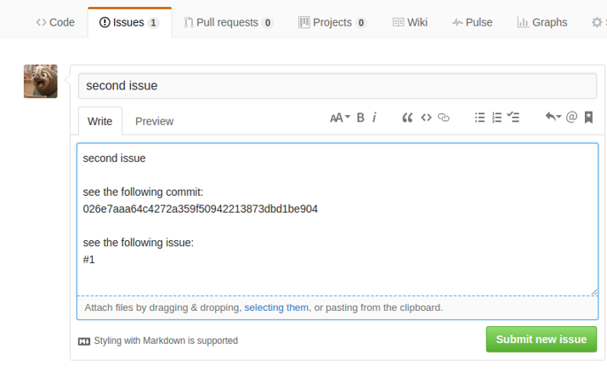
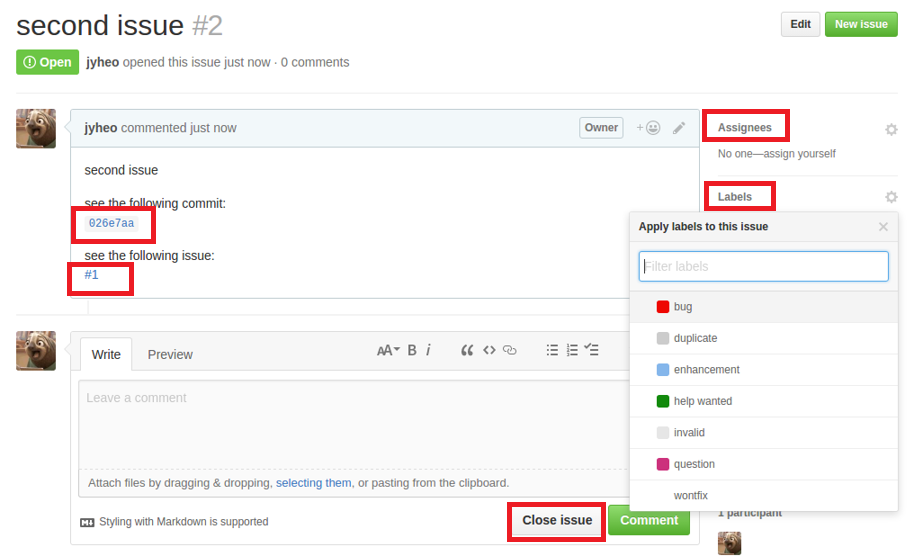

# Github Issue
<!-- _class: lead -->
### 허준영(jyheo@hansung.ac.kr)

## Github Issue
- Issues에서 New issue 버튼
	- Commit ID를 복사해 붙여 넣으면 해당 commit에 대한 링크가 생김
	- \#과 issue 번호나 pull request 번호를 쓰면 링크가 생김

## Github Issue

## Github Issue
- 누구나 issue를 만들 수 있음
	- 기능 제안, 버그 리포팅 등등
- 프로젝트 collaborator들이 issue의 중요도에 따라 label을 붙일 수 있음
	- 버그, 도움, 기능 추가 등
- 개발자가 issue를 직접 해결하고 close하거나 다른 사람에게 assign할 수 있음
- 어떻게든 해결하고 나면 close

## Good First Issue
- Issue 중 다른 사람들의 도움을 요청하는 label
- 보통 처음 contribute를 하고 싶어 하는 사람들을 대상으로 함
- 프로젝트 저장소를 알고 있다면,
	- github.com/<owner>/<repository>/contribute
- Github에서 임의의 good-first-issue를 찾고 싶다면
	- https://github.com/topics/good-first-issue