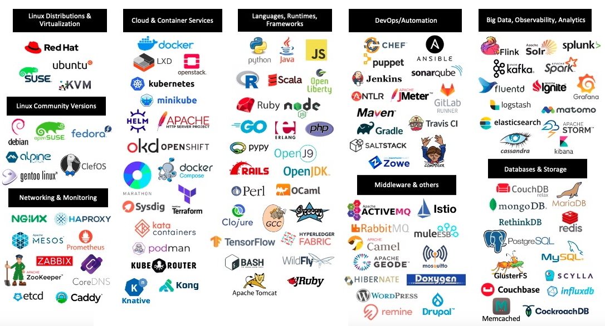

# 소프트웨어 혁신:   <small>오픈소스 개념과 라이선스</small>
<!-- _class: lead -->
### 허준영(jyheo@hansung.ac.kr)

## 내용
- 정보기술 발전과 디지털 대전환
- 오픈소스 소프트웨어 정의
- 오픈소스 소프트웨어 장점
- 오픈소스 소프트웨어 개발 도구
- 오픈소스 소프트웨어 라이선스
- 오픈소스 소프트웨어 검색하기

## 디지털 대전환(Digital Transformation, DX, DT)
- 전산화(Digitization)
	- 아날로그 데이터를 컴퓨터가 처리 가능한 디지털 정보로 변환
	- 1990년대 후반부터 정부의 정보화 사업, 각종 행정 데이터베이스 구축
- 디지털화(Digitalization)
	- 전산화된 데이터를 이용해 기존 업무 처리를 자동화
	- 온라인 결재 시스템, 온라인 재고 관리 시스템
- 디지털 대전환(DX)
	- 인공지능(AI), 클라우드, 빅데이터 등 **정보기술**을 활용하여 기업, 산업, 사회 전반의 비즈니스 모델, 조직문화 등 일하는 방식을 근본적으로 혁신
	- 인터넷 은행, 스타벅스(모바일 주문·결제, 메뉴 추천, AI 재고 관리 등)
	- 참고> AI시대

## 정보기술 발전
- 1940년대: 전자식 컴퓨터, ENIAC
- 1950년대: 어셈블리어, 고급 프로그래밍 언어(포트란)
- 1960년대: 데이터베이스 관리 시스템 (DBMS)
- 1970년대: 개인용 컴퓨터
- 1980년대: GUI 기반 운영체제, 인터넷
- 1990년대: WWW, 동영상 스트리밍
- 2000년대: SNS, 클라우드 컴퓨팅, 모바일 인터넷
- 2010년대: 스마트폰 확산, 알파고
- 2020년대: 생성형 AI(ChatGPT)
- 미래: AGI(범용 인공지능), 양자컴퓨팅

## 소프트웨어
- **정보기술**의 핵심 – 소프트웨어에 의한 가치 창출
- 컴퓨터나 디지털 기기에서 특정한 작업을 수행하기 위해 만들어진 프로그램과 관련 데이터의 총칭
- 즉, 하드웨어(컴퓨터의 물리적 장치)를 움직이게 하고 사용자가 원하는 기능을 수행할 수 있도록 지시하는 명령어 집합
- 소프트웨어 개발
	- 요구사항 분석 > 설계 > 구현(코딩) > 테스팅 > 배포 및 운영
	- 단계의 반복 수행으로 계속 개선

## 오픈소스 소프트웨어(OSS, Open Source Software)
- 오픈소스 소프트웨어는 소프트웨어 발전의 촉매제, 정보기술의 토대
- 오픈소스 소프트웨어는 공개되어 누구나 사용, 수정, 배포할 수 있는 소프트웨어
- 오픈소스 정신
	- 나눔과 개방성: 지식과 기술을 특정 집단이 독점하지 않고, 누구나 자유롭게 사용·수정·배포할 수 있음
	- 공동체 중심: 개인의 성취보다 협력과 커뮤니티 기여를 통해 더 큰 가치를 생성
	- 투명성과 진실성: 소스코드가 공개되어 누구나 검증할 수 있기에, 숨김 없는 투명성이 기본
	- 자발적 참여: 강제로 참여시키지 않고, 자발적인 기여와 헌신에 의해 발전

<!--
## 나눔과 개방성
- 오픈소스: 지식과 기술을 특정 집단이 독점하지 않고, 누구나 자유롭
게 사용·수정·배포할 수 있음
- 복음: 하나님의 은혜와 구원은 누구에게나 열려 있고, 특정 민족이나
집단만의 전유물이 아님
- “너희가 거저 받았으니 거저 주라.” (마태복음 10:8)
- “누구든지 목마르거든 내게로 와서 마시라.” (요한복음 7:37)

## 공동체 중심
- 오픈소스: 개인의 성취보다 협력과 커뮤니티 기여를 통해 더 큰 가치
를 생성
- 기독교 공동체: 교회는 몸의 여러 지체가 협력하여 전체를 세우는 공
동체적 성격
- “몸은 하나인데 많은 지체가 있고, 몸의 지체가 많으나 한 몸과 같이
…” (고린도전서 12:12)
- “서로 돌아보아 사랑과 선행을 격려하며…” (히브리서 10:24)

## 투명성과 진실성
- 오픈소스: 소스코드가 공개되어 누구나 검증할 수 있기에, 숨김 없는
투명성이 기본
- 예수님: 바리새인의 위선과 달리 진실한 마음, 내적 정직을 강조하심
- “화 있을진저 외식하는 서기관들과 바리새인들이여 회칠한 무덤 같으
니 겉으로는 아름답게 보이나 그 안에는 죽은 사람의 뼈와 모든 더러
운 것이 가득하도다” (마태복음 23:27-28)
- “외모로 판단하지 말고 공의롭게 판단하라.” (요한복음 7:24)

## 자발적 참여
- 오픈소스: 강제로 참여시키지 않고, 자발적인 기여와 헌신에 의해 발
전
- 기독교 신앙: 강제적 종교 행위가 아니라, 사랑에 이끌려 자발적으로
따르는 제자도를 강조
- “누구든지 나를 따라오려거든 자기를 부인하고 자기 십자가를 지고
나를 따를 것이니라.” (마가복음 8:34)
- “각각 그 마음에 정한 대로 할 것이요, 인색함으로나 억지로 하지 말지
니 하나님은 즐겨 내는 자를 사랑하시느니라.” (고린도후서 9:7)
-->

## 오픈소스 소프트웨어 정의
- Open-source software (OSS) is computer software that is released under a **license** in which the copyright holder grants users the **rights to use, study, change, and distribute the software and its source code to anyone and for any purpose.**
	- Open-source software may be **developed in a collaborative, public manner.** 
	- Open-source software is a prominent example of open collaboration, meaning any capable user is able to participate online in development, making the number of possible contributors indefinite. 
	- The ability to examine the code facilitates public trust in the software.
- 오픈소스 소프트웨어(Open source software; OSS)는 **소스 코드를 공개해 누구나 특별한 제한 없이 그 코드를 보고 사용할 수 있는 오픈소스 라이선스를 만족하는 소프트웨어**를 말한다. 

출처: Wikipedia(위키피디아)

## 오픈소스 소프트웨어 정의
- 단순 소스 공개가 OSS는 아님
- Free Redistribution
	- 무료
- Source Code
	- 소스 접근 가능, 컴파일 가능, 프로그래머가 이해/수정 가능한 형태
- Derived Works (파생물)
	- 수정 및 재배포 가능

출처: https://opensource.org/osd

## 오픈소스 소프트웨어 =? Free Software

## OSS 장점
- 상용 소프트웨어에 비해 얻기 쉽고, 따라서 사용자 확대가 용이함.
	- 기업들이 자사의 SW를 OSS로 공개
- OSS 개발 방법은 신뢰성 있고 고 품질 소프트웨어를 빠르고 저비용으로 개발하는데 도움이 됨
	- 수 많은 개발자와 테스터(사용자)
	- 수 많은 검증된 무료 라이브러리
- 특정 회사 제품에 묶일 필요 없음
	- Freedom from vendor lock-in

## OSS 개발 방법
- 사용자를 공동 개발자로 취급함
- 초기 개발 단계에도 릴리즈
- 자주 통합
	- 심지어 매일 매일하는 경우도 있음
- 여러 버전을 제공
	- 개발자 버전: 기능은 더 많지만 버그도 많을 수 있는 버전
	- 안정화 버전: 더 안정적이지만 기능은 좀 적은 버전
- 모듈화
	- 동시에 개발이 가능하도록 독립적인 요소들로 잘 나뉘어져 있음
- 동적 의사 결정 구조

## OSS 개발 도구
- 버전 관리 시스템
	- 많은 개발자가 참여하기 위해 필수
	- CVS, SVN, Git
	- 지금은 Git이 대세!
- 이슈 트래커
	- 개발자, 사용자들의 의사소통(기능 요청, 버그 보고 등)
	- bugtrackers, mailling list, IRC
- 코드 리뷰 시스템
	- Gerrit, Rhodecode, Gitlab
- CI/CD(Continuous Integration/Continuous Delivery)
	- Travis-CI, Jenkins, Github Actions

## 소프트웨어 라이선스
- 소프트웨어 라이선스(사용권, Software License)는 소프트웨어를 사용할 수 있는 권한 또는 사용을 허가한다는 내용을 담은 문서 따위를 말한다. 이 때 소프트웨어는 소프트웨어 구성 요소일 수도 있고, 독립적인 소프트웨어일 수도 있다.
- 소프트웨어를 허가 없이 사용하는 행위는, 소프트웨어 소유자에 대한 권리를 침해하는 것이며, 이 행위를 한 자는 소프트웨어 소유자로부터 저작권법 또는 드물게 특허법에 의거 소송을 당할 수 있다.
- 사용권 문서를 받은 자는, 사용권 문서에 명기된 조항에 따라 소프트웨어를 사용하는 것이 허가된다.
- From Wikipedia
- 저작자(Author) vs. 사용권(License),저작권자

## OSS License
- 공개SW포탈
	- www.oss.kr
- 오픈소스SW 라이선스 종합정보시스템
	- https://www.olis.or.kr
	- 오픈소스 라이선스, 프로젝트, 오픈소스 사용여부 검사 등의 서비스 제공
	- 한국저작권위원회
- Open Source Initiative(OSI)
	- https://opensource.org/
	- 공개 소스 소프트웨어(OSS) 인증 마크
	- 오픈소스 라이선스 인증
	- 비영리 단체
	

## Permissive vs. Copyleft
항목	| Permissive	| Copyleft 
--------|--------------|---------
소스코드 공개 의무	| 없음	| 있음
라이선스 변경	| 자유롭게 가능	| 불가(동일 라이선스 유지)
상용 SW 결합	| 제한 없음	| 강한 Copyleft는 제한 있음
대표 예시	| MIT, BSD, Apache	| GPL, LGPL, MPL, AGPL

## OSS License
- 법률적 문제, 간단하지 않음
- GPL
	- Copyleft, 파생물/수정 사항 공개 의무
	- 명시적 특허 사용 허락 (3.0부터)
- LGPL
	- LGPL로 된 라이브러리를 사용한 경우 공개 의무가 없음
- MIT
	- Copyleft나 수정 사항 공개 등의 의무가 없음
- Apache 2.0
	- Copyleft나 수정 사항 공개 등의 의무가 없음
	- 명시적 특허 사용 허락
- MIT(90% 이상)와 Apache 2.0이 가장 많이 사용됨

## OSS License

## OSS License 위반 모니터링

출처: 국가R&D 공개SW 활용방안, NIPA, 2011

## OSS 프로젝트

## OSS 찾기
- Black Duck Open Hub
	- https://www.openhub.net
- Free Open Source Software
	- http://freeopensourcesoftware.org/
- 위키피디아 문서
	- https://en.wikipedia.org/wiki/List_of_free_and_open-source_software_packages

## Black Duck Open Hub

## 기업에서 OSS 사용 현황
- 절반 이상의 소프트웨어 회사가 OSS 사용
	- 절반 가까운 회사가 OSS에 대한 정책(검증, 변경 추적, 취약점 파악 등) 부재
- 회사가 개발자에게 OSS 기여 권장
	- 상당 수 회사가 풀타임 OSS 개발자 있음
- OSS 기여 이유
	- 버그 수정/ 기능 추가, 경쟁력 확보, 개발 비용 절감
- OSS 사용 이유
	- 품질, 좋은 기능/기술, 커스터마이즈 가능
- OSS 사용 부분
	- 운영체제, 데이터베이스, 개발 도구(많은 회사가 버전관리로 Git 사용)
- OSS를 통한 수익
	- SaaS, 커스텀 개발, 서비스/지원

## 오픈소스 AI

.           | 폐쇄형 AI | 오픈형 모델 	| 오픈형 모델 | 오픈소스 AI 
-----------|---------------|--------------------|------------------|-------------------
라이선스 |  Proprietary	| Non-Permissive	| Permissive  |	OSI 인증 라이선스 (Permissive)
가중치 공개	| X	| O	| O | O
소스 코드 공개	| X	| Δ	| Δ	| O
학습 데이터 공개	| X	| X| 	X	| O
예	| GPT-4, Gemini 2.5 | Llama 4, Gemma 3 | DeepSeek R1, Qwen(Alibaba)	| Bloom AI

# 감사합니다.   Q&A
<!-- _class: lead -->