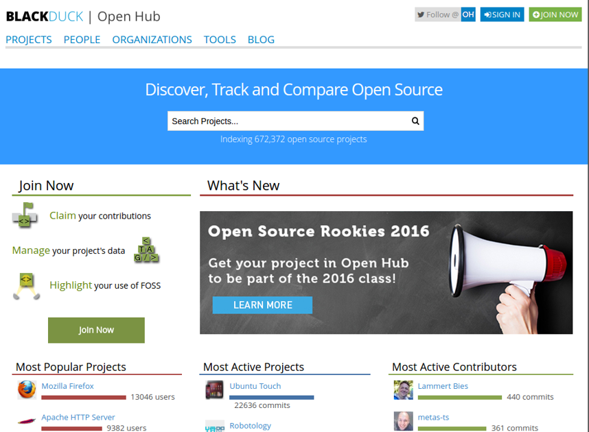

# Open Source Software
<!-- _class: lead -->
### 허준영(jyheo@hansung.ac.kr)

## 오픈 소스 소프트웨어 정의
- Open-source software (OSS) is computer software with its **source code made available with a license** in which the copyright holder **provides the rights to study, change, and distribute the software to anyone and for any purpose.**
- Open-source software may be **developed in a collaborative public manner.** According to scientists who studied it, open-source software is a prominent example of open collaboration.
from Wikipedia
- 오픈 소스 소프트웨어(open source software, OSS)는 **소스 코드를 공개해 누구나 특별한 제한 없이 그 코드를 보고 사용할 수 있는 오픈 소스 라이선스를 만족하는 소프트웨어를 말한다.** 통상 간략하게 오픈 소스라고 말하기도 한다.

출처: 위키피디아

## 오픈 소스 소프트웨어 정의
- 단순 소스 공개가 OSS는 아님
- Free Redistribution
	- 무료
- Source Code
	- 소스 접근 가능, 컴파일 가능, 프로그래머가 이해/수정 가능한 형태
- Derived Works
	- 수정 및 재배포 가능

출처: https://opensource.org/osd

## OSS 장점
- 상용 소프트웨어에 비해 얻기 쉽고, 따라서 사용자 확대가 용이함.
	- 기업들이 자사의 SW를 OSS로 공개
- OSS 개발 방법은 신뢰성 있고 고 품질 소프트웨어를 빠르고 저비용으로 개발하는데 도움이 됨
	- 수 많은 개발자와 테스터(사용자)
	- 수 많은 검증된 무료 라이브러리
- 특정 회사 제품에 묶일 필요 없음
	- Freedom from vendor lock-in

## OSS 개발 방법
- 사용자를 공동 개발자로 취급함
- 초기 개발 단계에도 릴리즈
- 자주 통합
	- 심지어 매일 매일하는 경우도 있음
- 여러 버전을 제공
	- 개발자 버전: 기능은 더 많지만 버그도 많을 수 있는 버전
	- 안정화 버전: 더 안정적이지만 기능은 좀 적은 버전
- 모듈화
	- 동시에 개발이 가능하도록 독립적인 요소들로 잘 나뉘어져 있음
- 동적 의사 결정 구조

## OSS 개발 도구
- 버전 관리 시스템
	- 많은 개발자가 참여하기 위해 필수
	- CVS, SVN, Git
	- 지금은 Git이 대세!
- 이슈 트래커
	- 개발자, 사용자들의 의사소통(기능 요청, 버그 보고 등)
	- bugtrackers, mailling list, IRC
- 코드 리뷰 시스템
	- Gerrit, Gitlab, Rietveld
- 지속적 통합 시스템(Continuous Integration)
	- Travis-CI, Jenkins
	

## OSS License
- 공개SW포탈
	- www.oss.kr
- 오픈소스SW 라이선스 종합정보시스템
	- https://www.olis.or.kr
	- 오픈 소스 라이선스, 프로젝트, 오픈 소스 사용여부 검사 등의 서비스 제공
	- 한국저작권위원회
- Open Source Initiative(OSI)
	- https://opensource.org/
	- 공개 소스 소프트웨어(OSS) 인증 마크
	- 오픈 소스 라이선스 인증
	- 비영리 단체
	

## OSS License
- 법률적 문제, 간단하지 않음
- Copyleft: 수정/재배포시 동일 라이선스 강제 조항
- GPL
	- Copyleft, 파생물/수정 사항 공개 의무
	- 명시적 특허 사용 허락 (3.0부터)
- LGPL
	- LGPL로 된 라이브러리를 사용한 경우 공개 의무가 없음
- MIT
	- Copyleft나 수정 사항 공개 등의 의무가 없음
- Apache 2.0
	- Copyleft나 수정 사항 공개 등의 의무가 없음
	- 명시적 특허 사용 허락
- MIT와 Apache 2.0이 가장 많이 사용됨

## OSS 찾기
- Black Duck Open Hub
	- https://www.openhub.net
- Free Open Source Software
	- http://freeopensourcesoftware.org/
- 위키피디아 문서
	- https://en.wikipedia.org/wiki/List_of_free_and_open-source_software_packages

## Black Duck Open Hub

## Black Duck Open Hub

